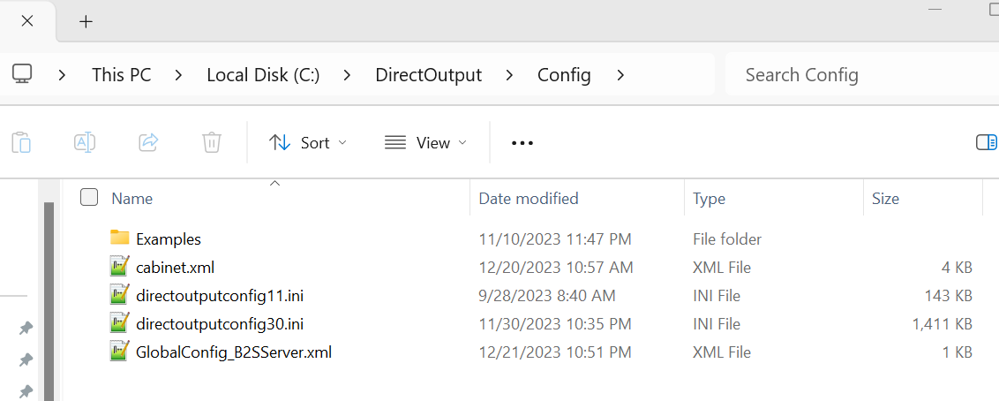

# Configuring in DOF

## Prerequisites

Before configuring in DOF, you need to have DOF installed. To install and configure DOF, see the steps [Here](../DOF/installing)

## Creating a global config file

You can use DOF `GlobalConfigEditor.exe` located in your `C:/DirectOutput` directory to create a global config file, but I always like to keep things consistent, so it's much easier to simply copy and paste this file into your C:/DirectOutput/config directly and save it as `GlobalConfig_B2SServer.xml`. The only thing to modify here is the file paths in case your DirectOutput directory is different from the one below.

```xml
<?xml version="1.0" encoding="utf-8"?>
<!--Global configuration for the DirectOutput framework.-->
<!--Saved by DirectOutput Version 3.1.8715.331: 2023-11-23 11-41-48-->
<GlobalConfig>
  <LedWizDefaultMinCommandIntervalMs>10</LedWizDefaultMinCommandIntervalMs>
  <LedControlMinimumEffectDurationMs>60</LedControlMinimumEffectDurationMs>
  <LedControlMinimumRGBEffectDurationMs>120</LedControlMinimumRGBEffectDurationMs>
  <PacLedDefaultMinCommandIntervalMs>10</PacLedDefaultMinCommandIntervalMs>
  <IniFilesPath>C:\DirectOutput\Config</IniFilesPath>
  <CabinetConfigFilePattern>C:\DirectOutput\Config\cabinet.xml</CabinetConfigFilePattern>
  <TableConfigFilePatterns />
  <EnableLogging>true</EnableLogging>
  <ClearLogOnSessionStart>true</ClearLogOnSessionStart>
  <LogFilePattern>.\DirectOutput.log</LogFilePattern>
</GlobalConfig>
```

## Relocating your ini files

When DOF is configured without a Cabinet.xml file, you can just put your ini files in the same directory as DOF and it will work fine, if you have a cabinet file you should put all your ini files in the C:/DirectOutput/config directory to ensure they are all read in. This also keeps things a little cleaner now that you will have more than one file for your configuration.

## Creating your cabinet file

The cabinet file for Addressable LEDs is a little complicated to build, so I have created a simple online helper to generate it for you. Simply enter your specific needs and it will be created. Copy the text from the code created below and save it as `cabinet.xml` inside your `C:/DirectOutput/config` directory.

You can find the cabinet file generator [Here](./cabinetGenerator)

## Final Steps

At this point your `C:/DirectOutput/config` directory should look like the following below:



The last thing to do is configure DOF for the Addressable LEDs. This step is fairly straight forward as you simply select the outputs that are needed based on your cabinet.xml configuration. This is discussed and an example is shown in the [DOF config section](../DOF/configuring) of the site

