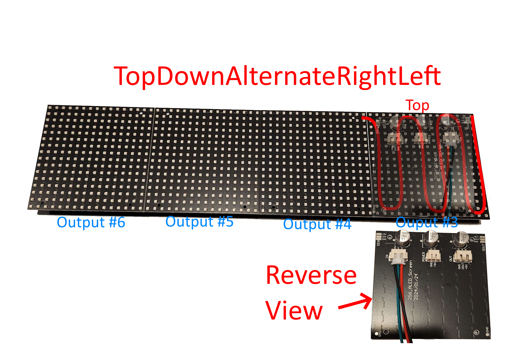
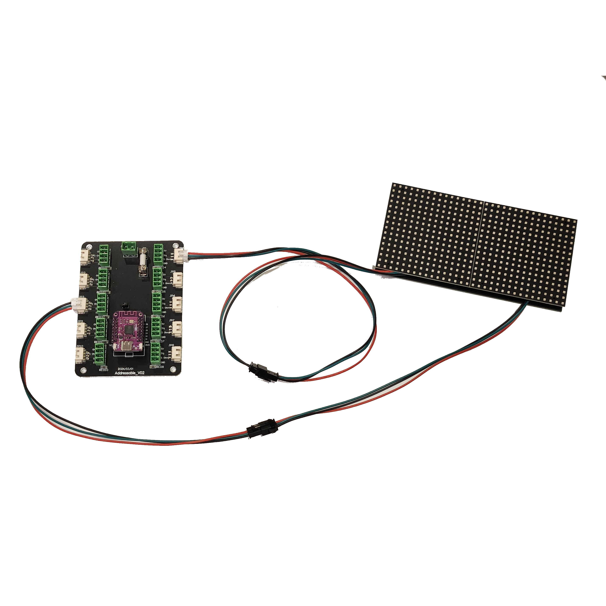
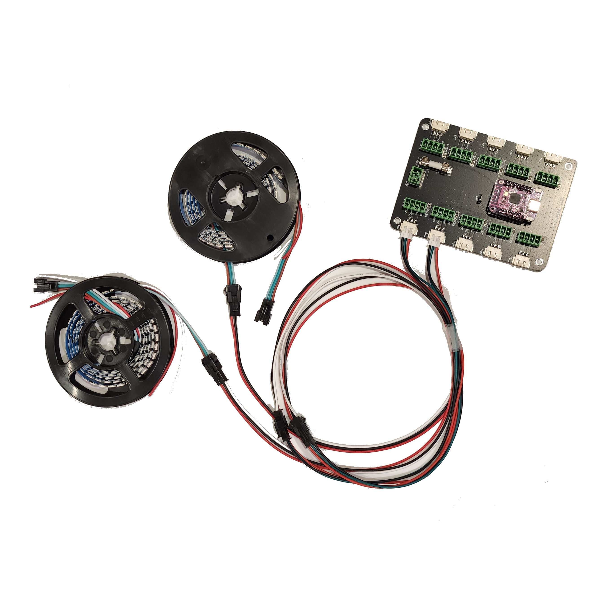

# Addressable Kits

## Introduction

Installing the kit is as simple as plugging in the matrix and strips into the LED board and then simply selecting one of the preset cabinet configurations from the [cabinet generator](./cabinetGenerator) and following the instructions for setting up the addressable LED board in DOF.

## Installing

For installation, you just need to plug in the boards as follows:

 - Right strip: Output 1
 - Left strip: Output 2
 - Matrix board 1: Output 3
 - Matrix board 2: Output 4 
 - Continue to the last matrix board, up to 8 of them.

### Matrix board installation

Each panel should go into the addressable LED board to ensure the fastest framerate. You can combine panels if needed, but there should be enough outputs on the board to allow you to connect them all to their own dedicated output. See the picture below for how to connect:

#### Matrix connections and order:

#### Connecting the matrix to the board (JP3 is the first matrix panel, JP4 is the second matrix panel):

#### Connecting the strips to the board (JP1 is the right strip, JP2 is the left strip):
