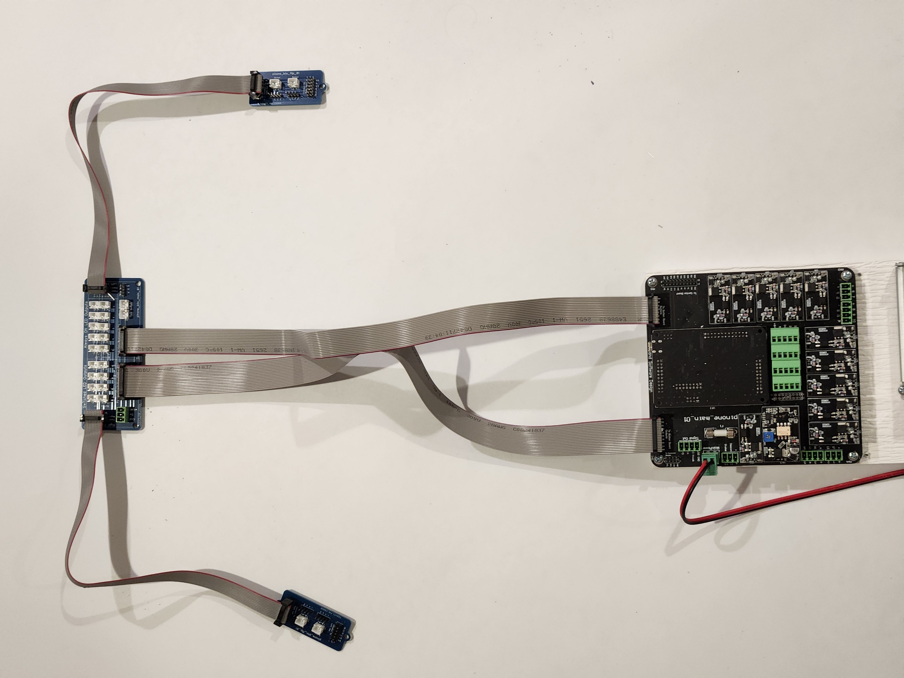
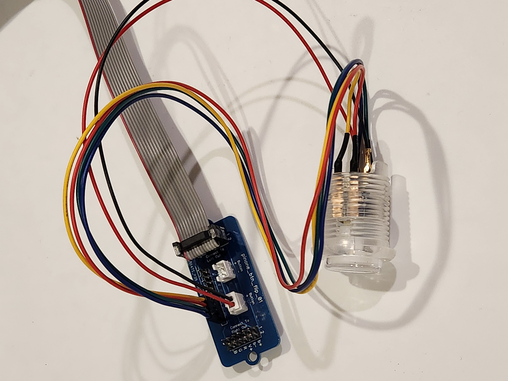
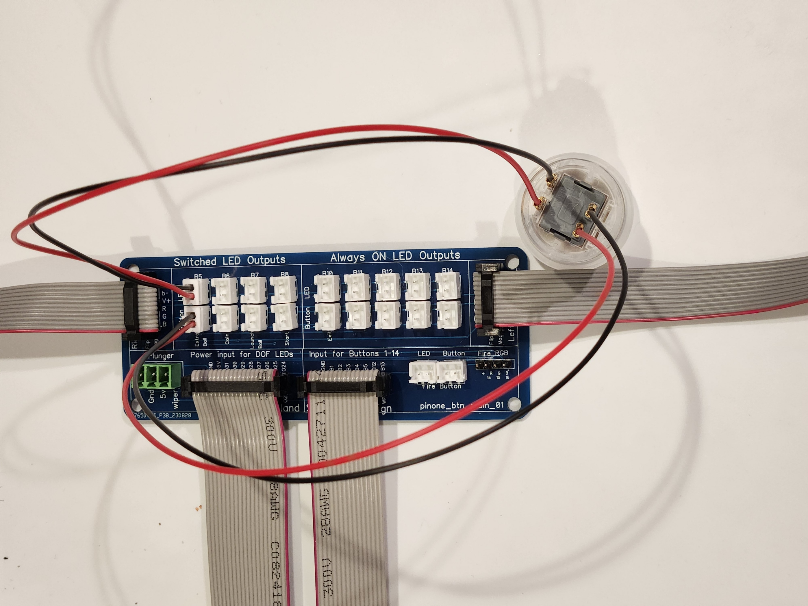
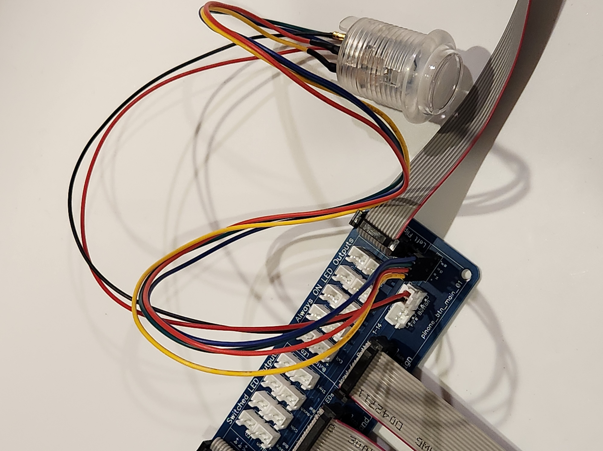

# Connecting the Button Board

There are two ribbon cables that connect from the PinOne Main board to the Button board, and two additional ribbon cables that connect the Button board to the side flipper boards that extend to the side of the cabinet for connecting the flipper buttons. 

## Connecting the button board to the PinOne Main board

When connecting the ribbon cables, it is important to make the orientation of the cables are correct. If connected in the wrong orientation, it will not damage anything, but your buttons or lighted outputs will not work, so if you are having trouble with either of these, make sure the orientation is like the pictures below. 

## Connecting the RGB Button to the side boards

The picture below shows how to connect one RGB button to one of the side boards. You can connect two RGB buttons to each side board. The one labeled "B1" is the flipper button, and "B2" is the magna save button. This is important because DOF can independently control the lighted outputs of the magna save buttons, but the RGB outputs of the flippers are tied together. This means the flipper buttons will always be the same color as each other.

The left and right flipper RGB outputs are tied to the PinOne outputs 16, 17 and 18. The Right Magna save outputs are 19, 20 and 21 and the left Magna save outputs are 22, 23 and 24.

## Connecting buttons to the main board

Connecting the single color buttons to the main board is as easy as plugging them in. Because there is a button side and LED side to the buttons, I have included the picture below to show how to connect them correctly. On the button board, there are inputs for 5 DOF controlled lighted outputs and 5 "always on" 5v constant lighted outputs. These 5v lighted outputs are powered by the USB interface, so you should not connect any high current LEDs to them, limit them to LEDs that pull a maximum of 40mA of current.

## Connecting the Fire button to the main board

There is one additional button input that supports an RGB fire button or a single color LED button output. The RGB button is connected just like the flipper buttons on the side and is shown connected below

