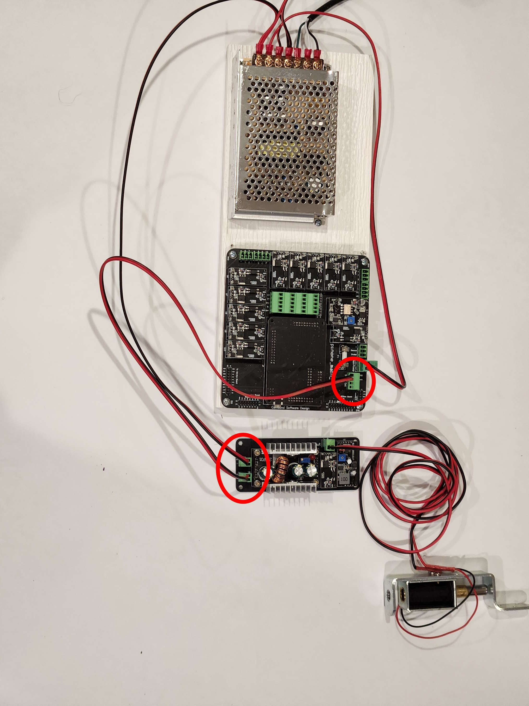

# Connecting the Knocker

The knocker is also not included in the kits, but is a nice option to add and comes pre-wired and ready to plug in if added to any of the kits. The knocker also needs to be connected to the 12v supply, and also uses one of the low power signal outputs on the PinOne Main board

