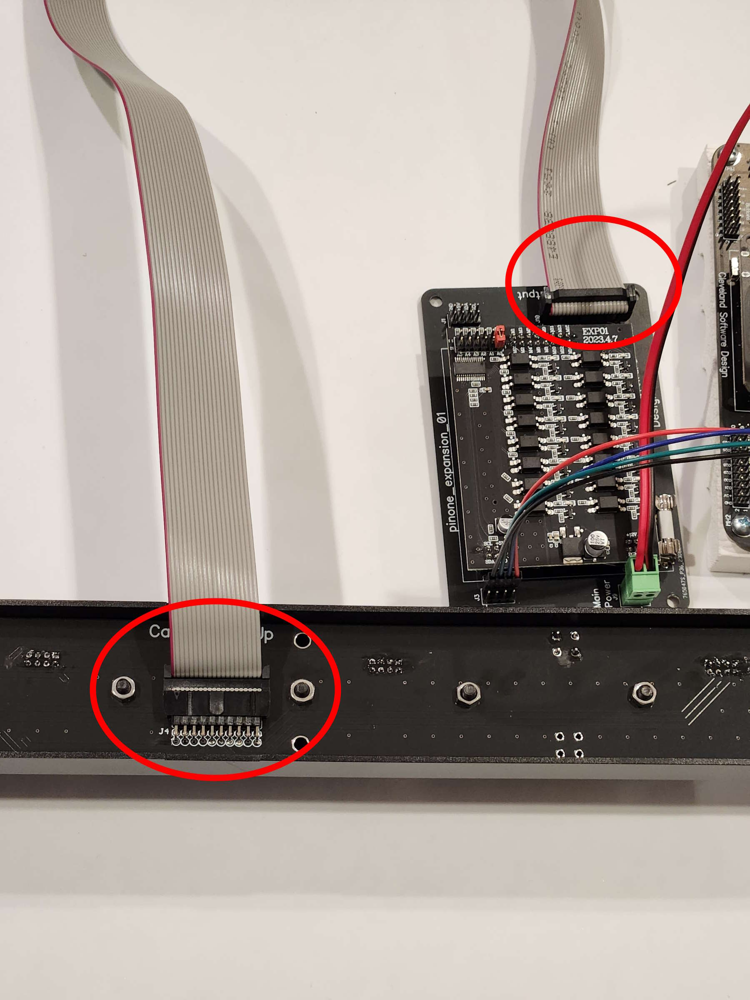

# Connecting the Light Bar

Connecting the light bar to the expansion board is as simple as connecting the 2 meter 20 pin ribbon cable between the expansion board and the light bar. You just need to be careful to get the polarity correct on the ribbon cable or you will have unexpected behavior. 

