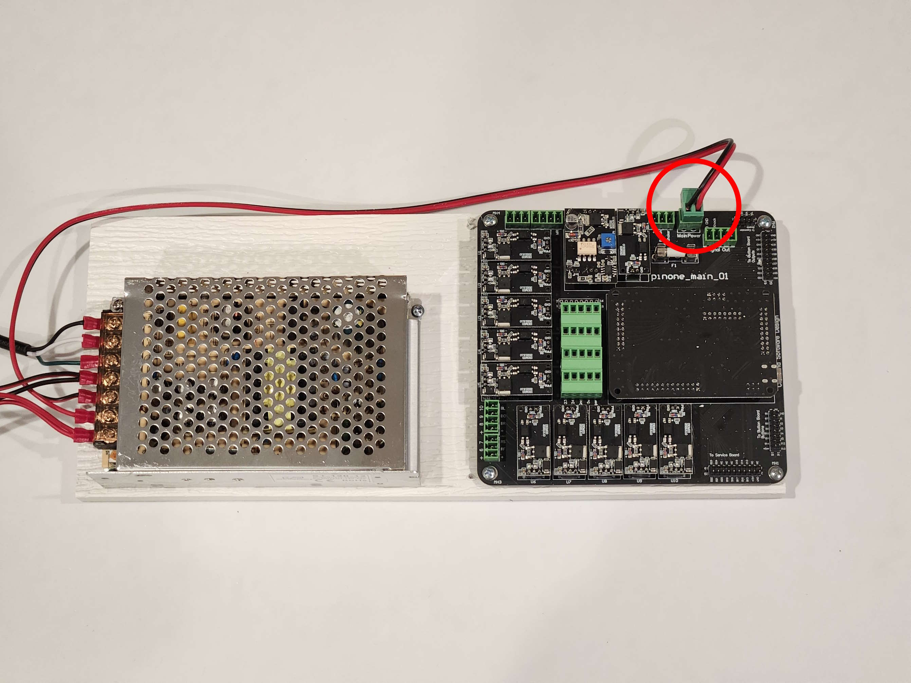

# Connecting the Main Board

The kit comes with the main board and the power supply mounted on the same board. All you need to do for the main board is plug in the power supply and ensure that the 2 pin connector is also plugged into the main board (shown below)

