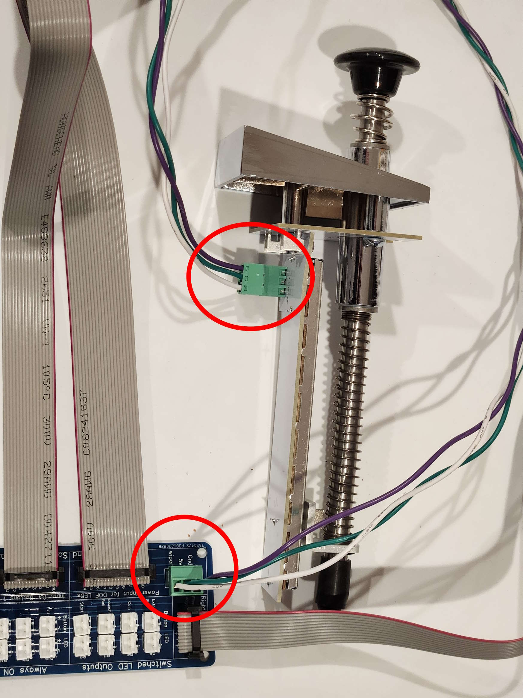
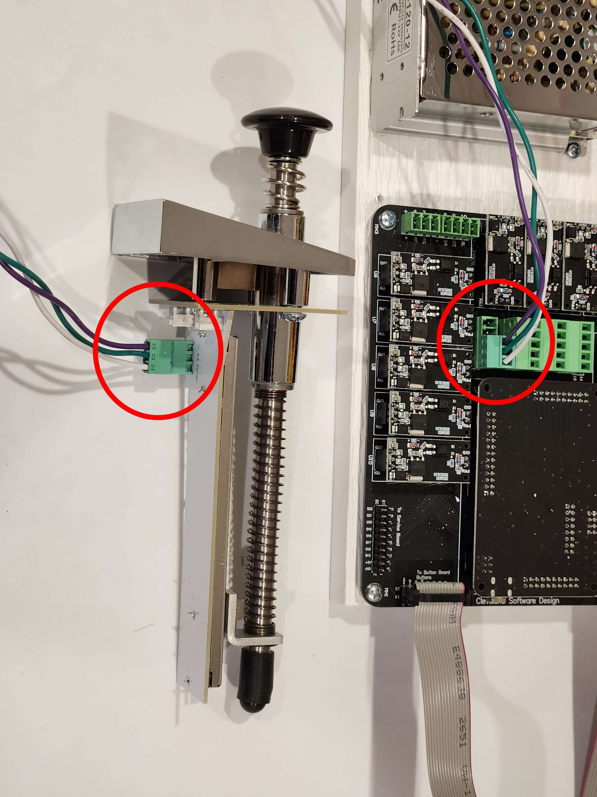

# Connecting the Plunger

You can connect the plunger to either the button board or the main board. It doesn't really matter which one you connect it to as both are electrically the same, but normally it's easier to connect it to the button board since it is near the front of the cabinet. 

### Connecting to the button board

### Connecting to the Main Board

