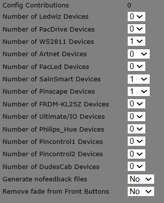
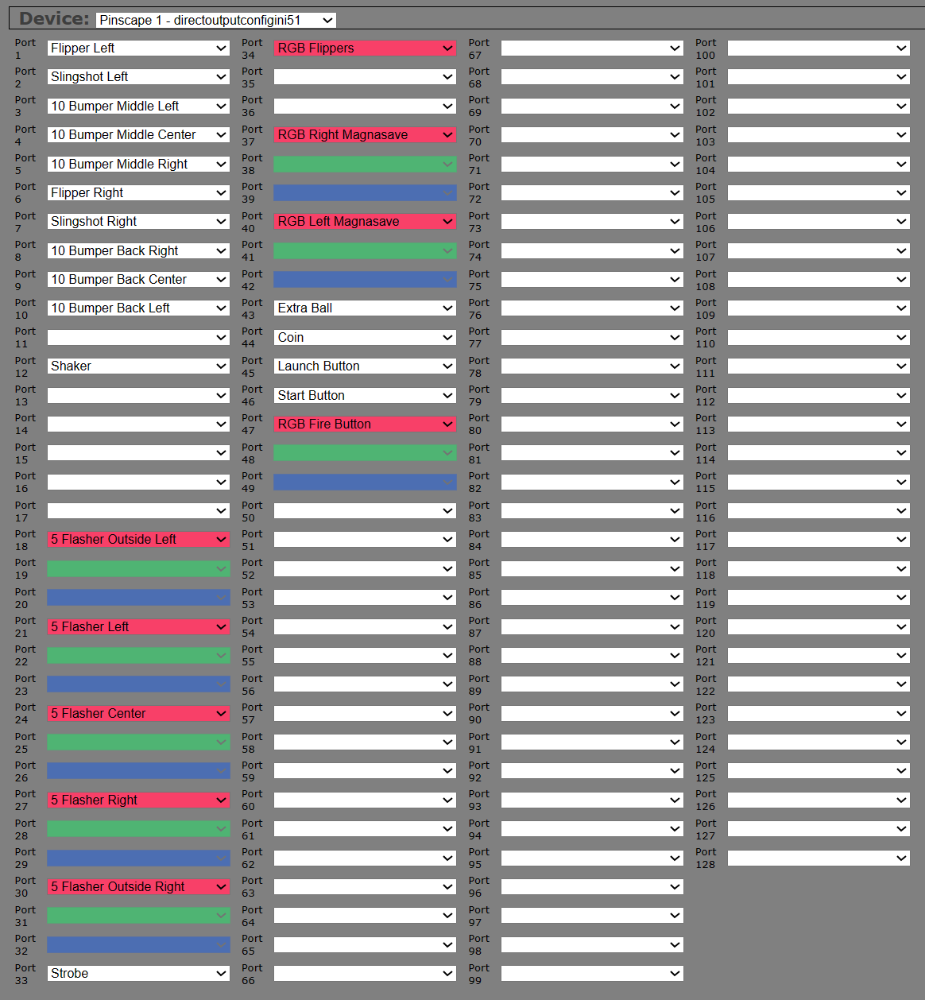
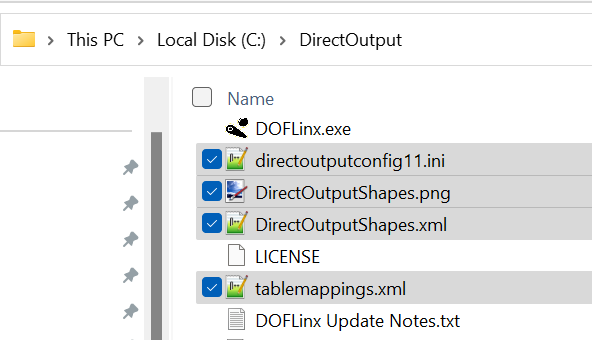

# Configuring DOF

In order to configure DOF, you need to setup a configuration file. The easiest way to do this is to create an account and login to the [DOF Config tool](http://configtool.vpuniverse.com/login.php) 

## Selecting your device
Once you have an account setup, navigate to ```My Account``` and select the number of devices for your setup.
 - For the PinOne or KL25Z Pinscape device, select ```pinscape```
 - for the 8 output ```sainsmart``` board that runs the plug and play shaker motor or some starter kits, select ```sainsmart```


## Creating a config file

When creating a config file for your setup, its simply a matter of selecting the outputs for each device in your cabinet. Output #1 in the config tool will match output #1 when you are manually testing your board, so it's not too difficult to create. I recommend simply turning on your machine, testing each output, then setting the output in the dropdown. Below is an example of what your configuration will look like after it's all complete:

### PinOne Config File


### Pinscape Config File


## Setting your config in DOF

Once you have everything set in the config tool, click the ```save``` button, then ```download config```. This will download a copy of the configuration files onto your PC. All you need to do now is move the files into your ```C:\DirectOutput\``` directory (or wherever DOF is installed on your PC) The end result should look something like the following:



:::note

For PinOne board, you will need to rename the file from `directoutputconfig51.ini` to `directoutputconfig11.ini`

:::


## Configuration Complete!

You should now be able to play Visual Pinball and have feedback on all supported tables! There are times when you need to enable the plugin in the situation where you do not have popper already installed. To do that, and also for tips on manually testing DOF, go to the next section [Troubleshooting](./troubleshooting)