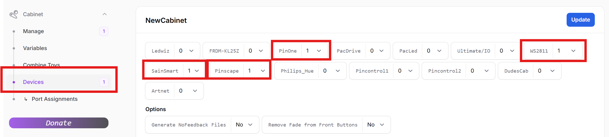
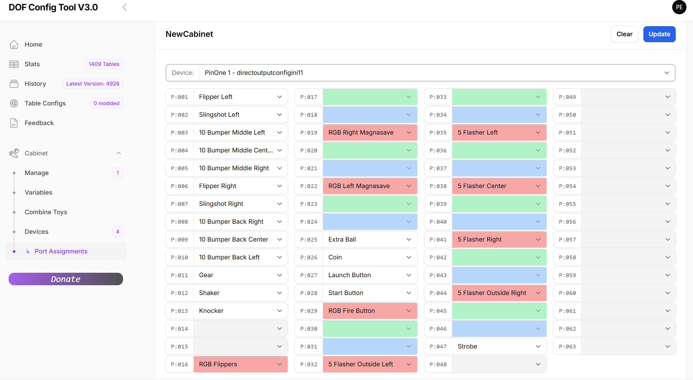
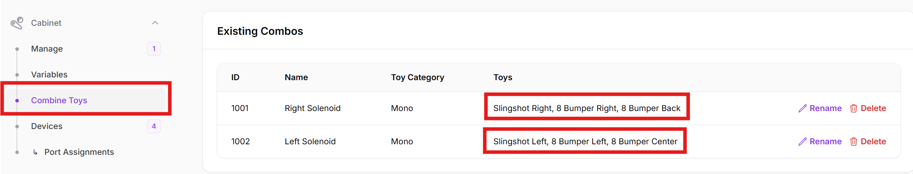
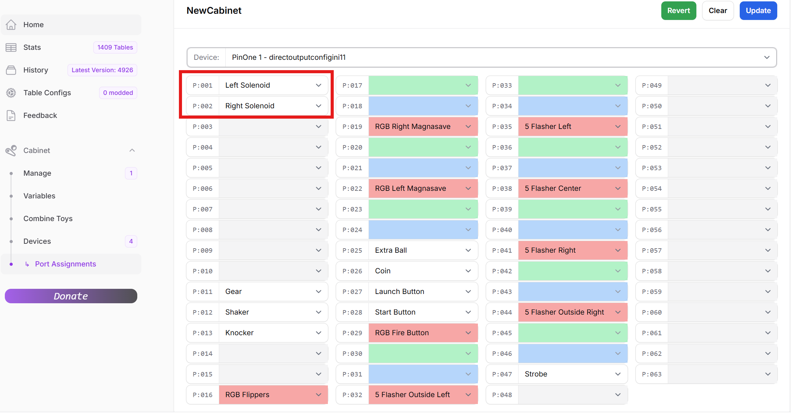
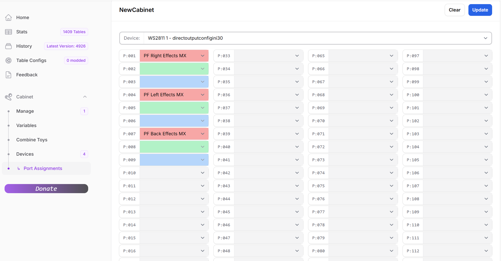
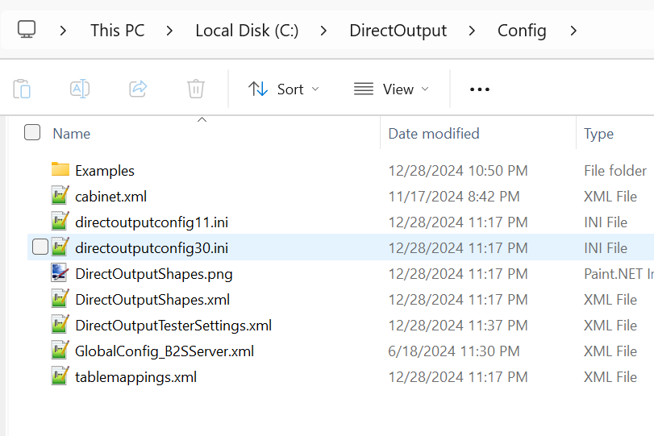

# Configuring DOF

In order to configure DOF, you need to setup a configuration file. The easiest way to do this is to create an account and login to the [DOF Config tool](https://configtool.vpuniverse.com/) 

## Selecting your device
Once you have an account setup, navigate to ```My Account``` and select the number of devices for your setup.
 - For the PinOne device, select ```PinOne```
 - For the KL25Z Pinscape device, select ```pinscape```
 - For the 8 output ```sainsmart``` board that runs the plug and play shaker motor or some starter kits, select ```sainsmart```
 - For the Addressable LED board, select ```WS2811```
 


## Creating a config file

When creating a config file for your setup, its simply a matter of selecting the outputs for each device in your cabinet. Output #1 in the config tool will match output #1 when you are manually testing your board, so it's not too difficult to create. I recommend simply turning on your machine, testing each output, then setting the output in the dropdown. Below is an example of what your configuration will look like after it's all complete:

### PinOne (builders kit) Config File


### PinOne Mini (two solenoid) Config File

For the PinOne Mini, if you only have 2 solenoids connected to it, then you will have a slightly different configuration file. The main difference is you want to share toys to ensure that you have solenoid feedback for the flippers and slings and pop bumpers. To do this, simply navigate to the "Combine Toys" section in the config tool and enter two new combos like the following:



If you would prefer DOF control the flippers, then you can also set the flippers in the toy combo and remove the button binding in the PinOne config tool.

Then modify the config so that all the combo outputs go directly to the 2 outputs with solenoids attached to them.



### Addressable LED Config File

For addressable LEDs, just select each output based on the type of LED strip you have configured in the Cabinet.xml file. In the case below, I have my cabinet setup in the most used configuration, a right LED strip, a left LED strip and then a back LED matrix. If you have more, then just add additional outputs. You can use the [cabinet generator](../AddressableLED/cabinetGenerator) to generate the cabinet file that should match what you have set in DOF for outputs.



## Setting your config in DOF

Once you have everything set in the config tool, click the ```save``` button, then ```download config```. This will download a copy of the configuration files onto your PC. All you need to do now is move the files into your ```C:\DirectOutput\config``` directory (or wherever DOF is installed on your PC) The end result should look something like the following:



## Configuration Complete!

You should now be able to play Visual Pinball and have feedback on all supported tables! There are times when you need to enable the plugin in the situation where you do not have popper already installed. To do that, and also for tips on manually testing DOF, go to the next section [Troubleshooting](./troubleshooting)