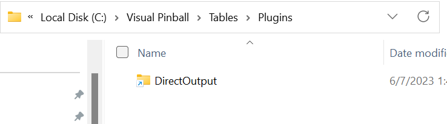
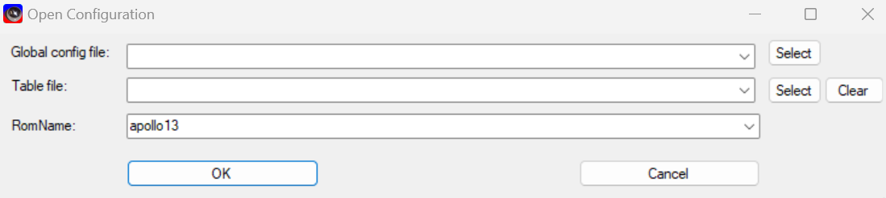
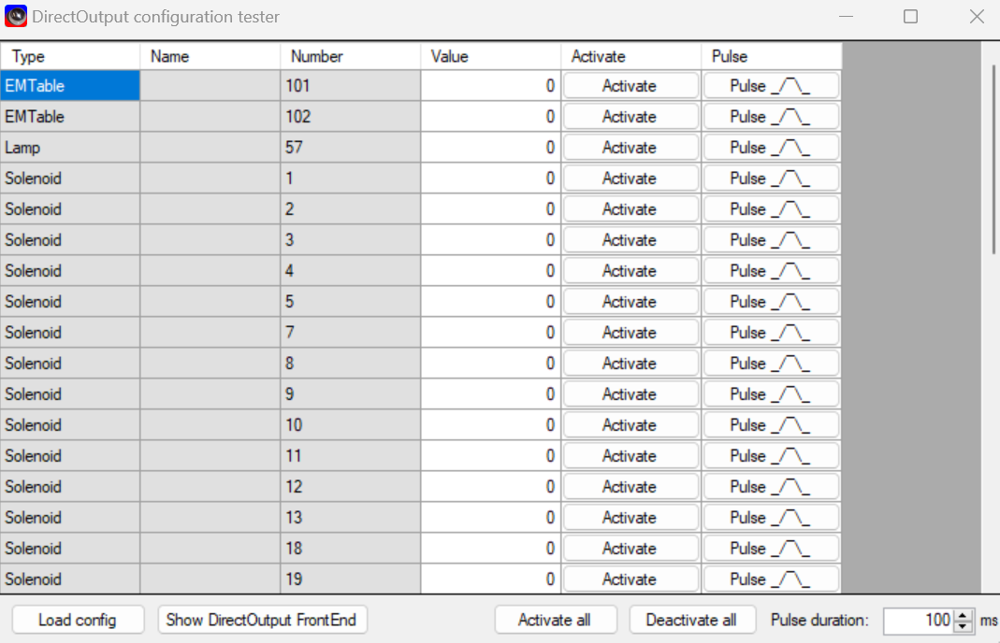
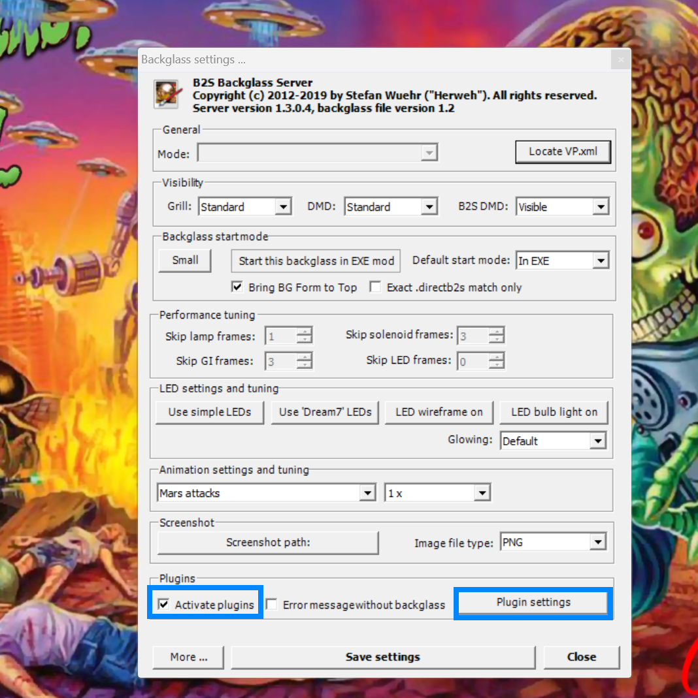
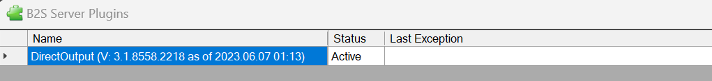
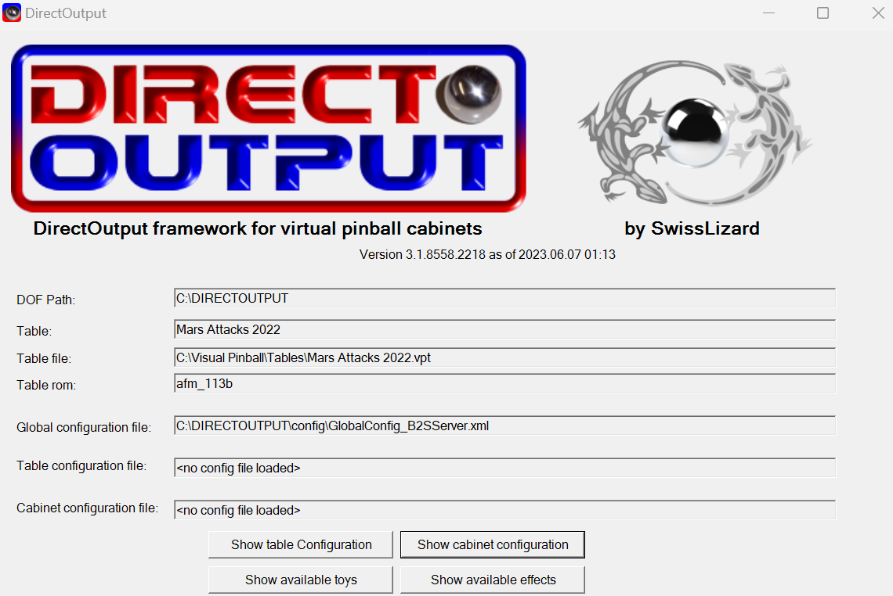
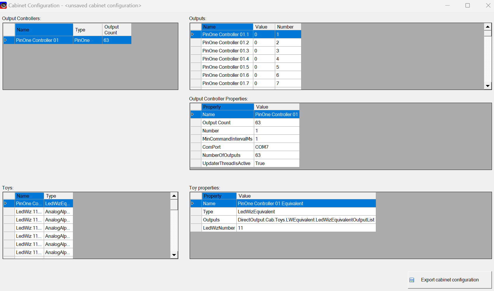

# Troubleshooting

If you suspect your install may not be right, here are some things to check for:

## Ensure link to DOF in Visual Pinball
Check to make sure that visual pinball has a link to DOF. Sometimes when DOF is installing it is unable to create this link to visual pinball, so you can always create it manually. There should be a link in your {Visual_Pinball_Install_Location}/tables/plugins that directs to the DOF install location.
 - Be sure that there are not duplicate shortcuts, or a shortcut going to another DOF location. There should only be one DOF installation on the PC


## Testing DOF manually
You can also manually test that your dof settings are correct by testing the output by opening the ```C:\DirectOutput\DirectOutputConfigTester.exe``` to test that DOF is working properly. Just select a ROM and leave the other two fields empty unless you have a cabinet file (normally only if you have addressable LEDs) in which case you will also want to select the global config file `GlobalConfig_B2SServer.xml`, then click OK and start testing the solenoids/toys/outputs there. If they work there, then you can be pretty sure DOF is setup correctly and it's just the link between DOF and VPX.



## Checking if DOF is enabled in Visual Pinball
To check and ensure DOF is configured properly in visual pinball, open a table in visual pinball and with the mouse cursor, right click on the backglass. At this time a dialog should open like the following:

 - Ensure that the ```enable plugins``` checkbox is checked
 - You can clock on the ```plugin settings``` button to see more details

 - double clicking on the direct output plugin will show an additional dialog. Below is an example of a properly configured DOF instance:

 - clicking on the ```Show Cabinet Configuration``` button will show if your board has been properly found and initialized but DOF. If there are no controllers showing up here, then you know that DOF has not found your output controller and DOF will not work.
 