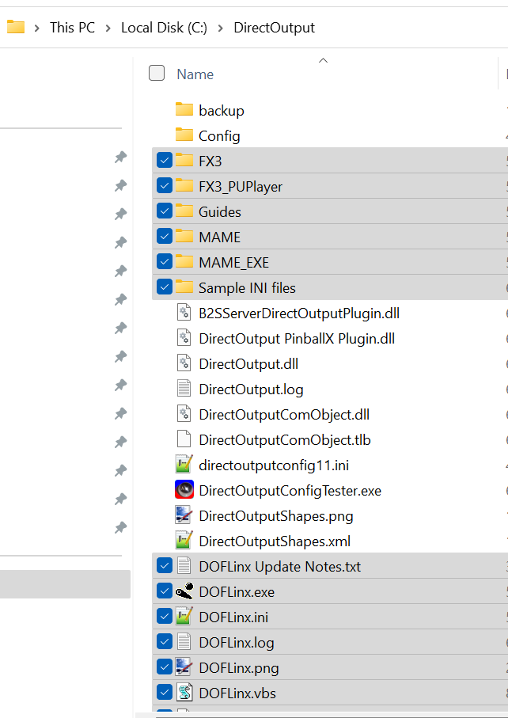

# Installing DOFLinx

### Prerequisites
Before installing DOFLinx, you should already have DOF installed. You can find out more about installing DOF [here](../DOF/index)

### Downloading files
First you need to download the files found here: [DOFLinx Files]( https://www.vpforums.org/index.php?app=downloads&showfile=12318)

After downloading, right click on the zip file and mark it as safe, then unzip all the files into ```C:\DirectOutput\``` (or wherever you have installed DOF). The end result should look like this:
