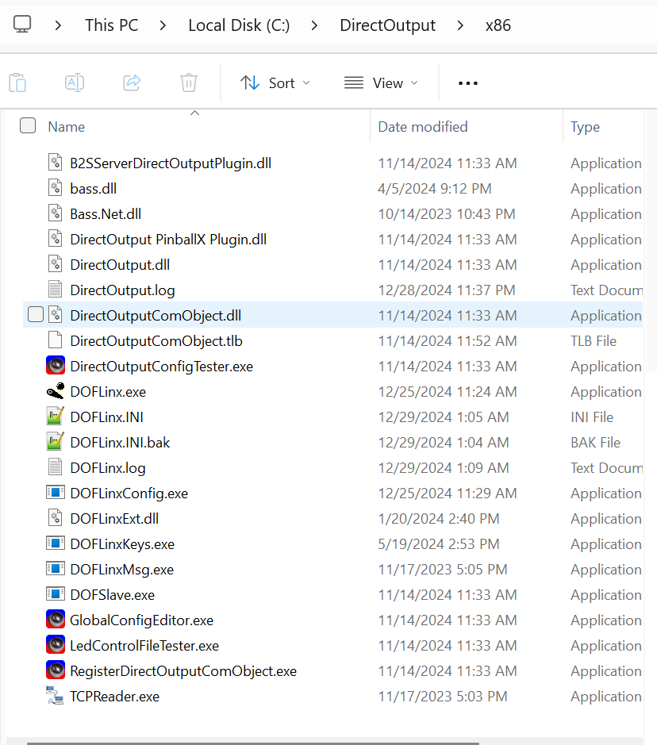

# Installing DOFLinx

### Prerequisites
Before installing DOFLinx, you should already have DOF installed. You can find out more about installing DOF [here](../DOF/)

### Downloading files
- Download the files found here: [DOFLinx Files](https://github.com/DOFLinx/DOFLinx/releases)

- After downloading, right click on the zip file, select properties


- Check the ```Unblock``` checkbox or the dll files in the zip folder will be blocked from running. Click ```Apply```


- Next unzip all the files

- Open the unzipped directory and move all the files (not all folders) into your DirectOutput/x86 OR /64 bit directory.

- Move the files inside the ```32 bit``` folder into the DirectOutput x86 folder, and the files inside the ```64 bit``` directory inside the x64 bit folder (if applicable)

- Next unzip all the other directories into ```C:\DirectOutput\``` (or wherever you have installed DOF). The end result should look like this:


