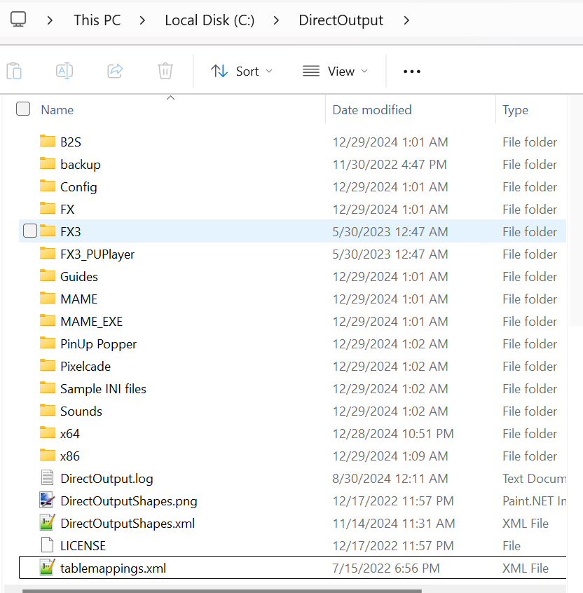

# Installing DOFLinx

### Prerequisites
Before installing DOFLinx, you should already have DOF installed. You can find out more about installing DOF [here](../DOF/)

### Downloading files
- Download the files found here: [DOFLinx Files]( https://www.vpforums.org/index.php?app=downloads&showfile=12318)

- After downloading, right click on the zip file, select properties


- Check the ```Unblock``` checkbox or the dll files in the zip folder will be blocked from running. Click ```Apply```


- Next unzip all the files into ```C:\DirectOutput\``` (or wherever you have installed DOF). The end result should look like this:
