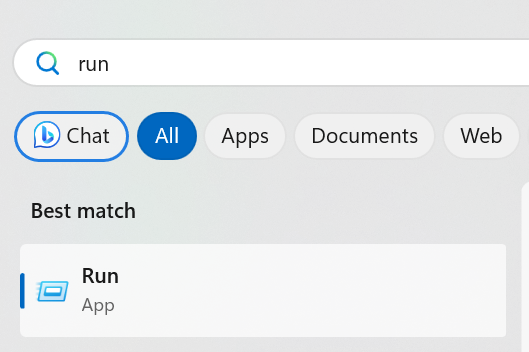
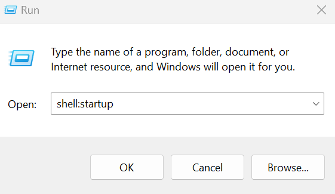
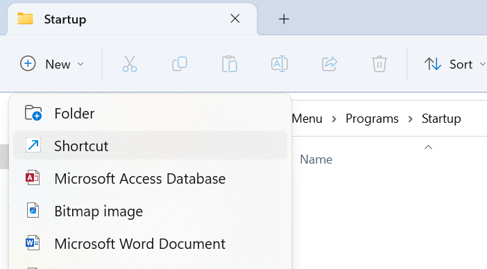
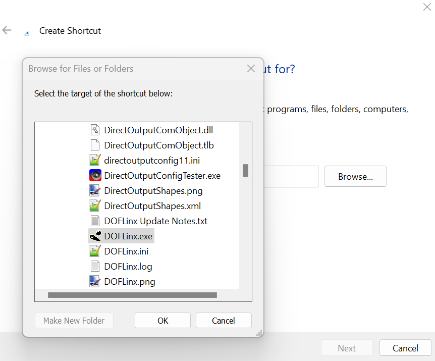

# Setting to auto run

If you want DOFLinx to start automatically with windows so you don't need to run it prior to running FX3 or any other pinball simulator, follow these instructions

1. hit the windows key and search for ```run``` and hit ```enter```


2. when the run dialog shows up, type in ```shell:startup``` and hit ```ok```


3. inside the startup directory, add a new shortcut:


4. browse to the DOFLinx.exe file and click OK.


5. the end result should have a link to doflinx inside the startup folder. Now anytime you start your computer. DOFLinx will be automatically started and ready to go