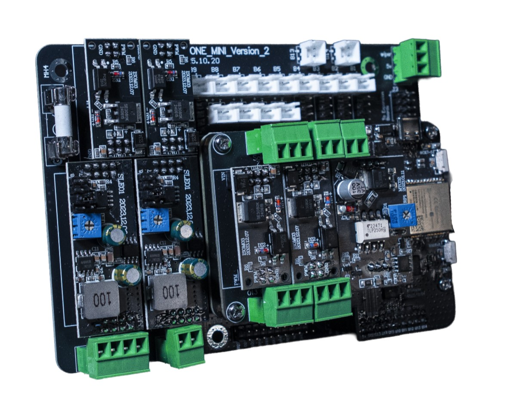

# Installing the Bluetooth Board

The PinOne Bluetooth board is designed as a plug-in expansion for the PinOne Mini. No soldering, tools, or additional wiring is required.

## Hardware Installation

1. Power off your PinOne Mini by disconnecting any USB connection.
2. Align the Bluetooth board with the header pins on the top of the PinOne Mini board.
3. Press the Bluetooth board firmly down onto the PinOne Mini until it is fully seated on the headers.

The Bluetooth board draws power directly from the PinOne Mini and requires no separate power connection. Once installed, you can still connect the PinOne Mini to your PC via USB for configuration purposes using the PinOne Configuration Tool.

## Pairing with Your PC

The Bluetooth board is always available to pair as long as it is not currently connected to another device. There is no button to press or mode to activate — simply power on the PinOne Mini and the board will be discoverable.

1. Power on the PinOne Mini with the Bluetooth board installed.
2. On your PC, open **Settings → Bluetooth & devices** and ensure Bluetooth is turned on.
3. Click **Add device → Bluetooth** and wait for the device list to populate.
4. Select **PinOne** (or the custom name you set in the Controller screen) from the list of available devices.
5. Once paired, the board will show up as a game controller in Windows.

> **Note:** If the PinOne does not appear in your device list, make sure it is not currently paired to another device such as a Meta Quest headset. You will need to disconnect it from that device first before it can be discovered here.

## Pairing with the Meta Quest Headset

To use the PinOne Bluetooth board with the Meta Quest, pair it through the headset's Bluetooth settings. The board is discoverable automatically — no button press or special mode is required, as long as it is not already connected to another device.

1. Put on your Meta Quest headset and navigate to **Settings → Devices → Bluetooth**.
2. Make sure the PinOne Mini is powered on with the Bluetooth board installed.
3. Select **Pair New Device** and wait for the PinOne to appear in the list.
4. Select **PinOne** to complete the pairing.

Once paired, the Meta Quest will recognize the PinOne as either a keyboard (for Pinball FX keyboard mode) or a gamepad (for VR Classic mode). See the [Meta Quest Configuration](./meta-quest) page for details on setting up each mode and switching between them.

## Switching Between Devices

If you want to pair the board with a different device, first disconnect or unpair it from the current device, then power cycle the PinOne Mini. Once it is no longer connected, it will be discoverable again from any Bluetooth device.
