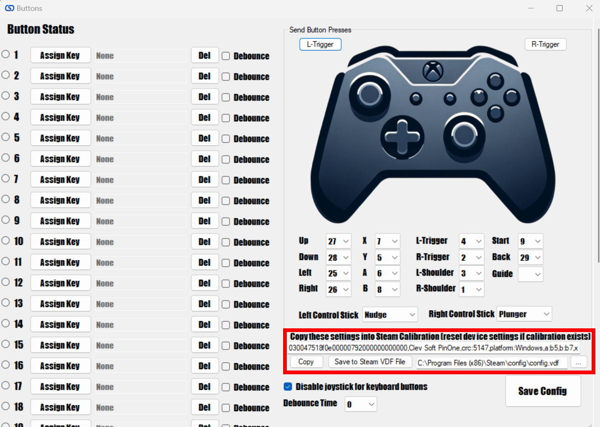
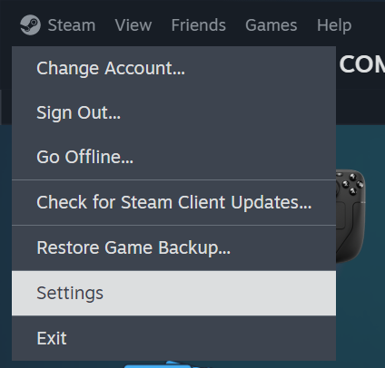
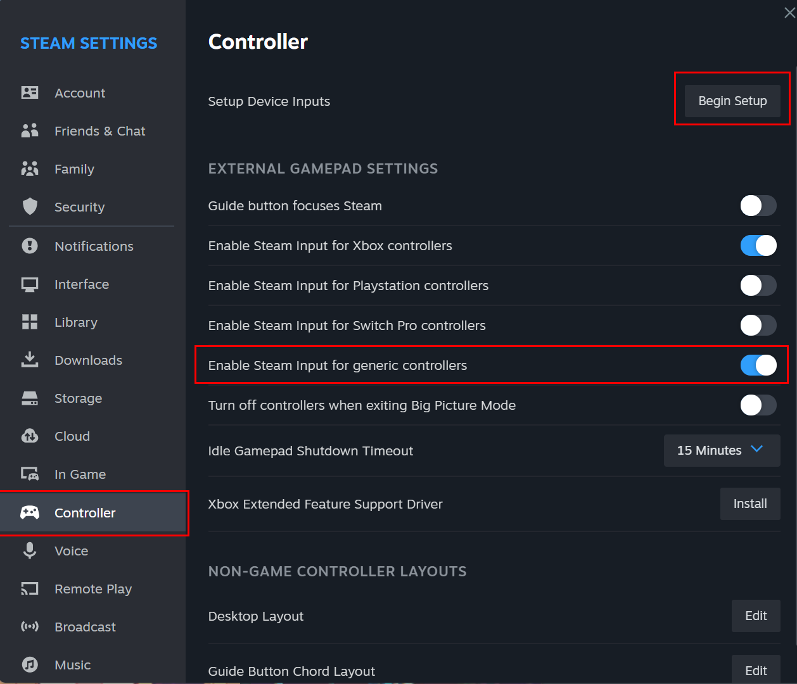
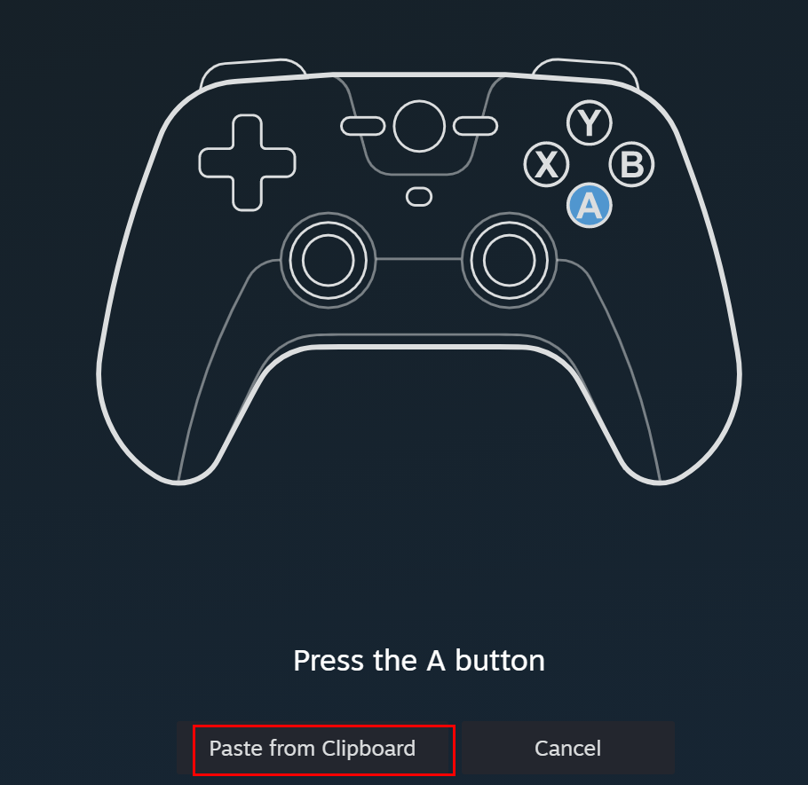
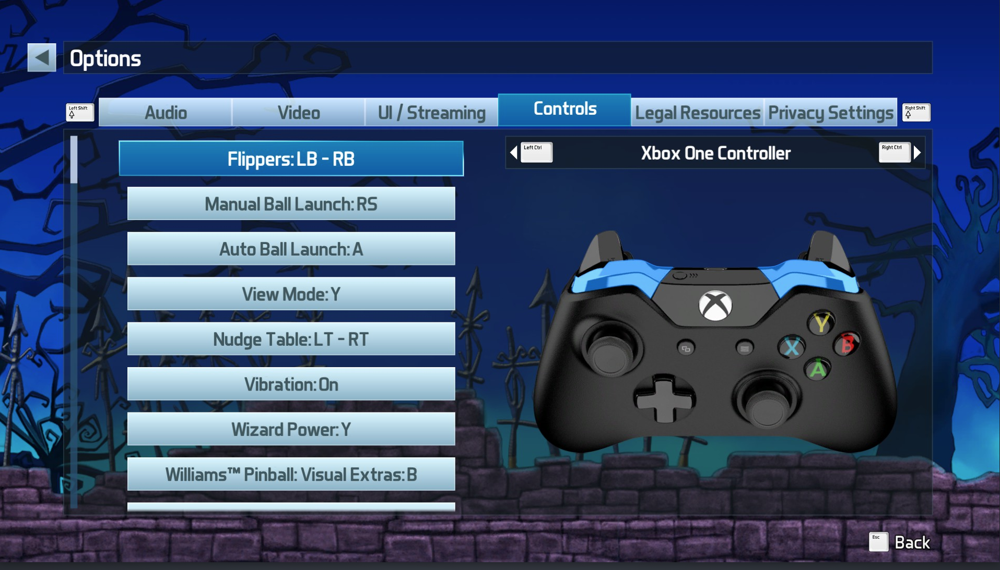

# Steam Configuration

The PinOne Bluetooth board uses a different controller mapping string than the wired USB connection, so you cannot reuse the standard PinOne VDF string for it. The recommended approach is to generate the correct string directly from the PinOne Configuration Tool and paste it into Steam during the controller configuration — this automatically reflects however you have your buttons configured.

Before configuring Steam, make sure the Bluetooth board is installed and paired with your PC. See [Installing the Bluetooth Board](./installing) for pairing instructions.

## Setting Up the Controller in Steam

1. Download the config tool from [here](https://github.com/philipellisis/arduino-virtual-pinball-board/releases/download/v2.2.0/pinone-config-tool.2.2.0.exe)
2. Connect to the PinOne board via USB and navigate to the **Controller** screen.
3. Use the dropdowns to assign the correct buttons to the Xbox controller layout shown on the page.
4. Once configured, copy the generated configuration string from the config tool.

5. Open Steam and go to **Steam → Settings → Controller**.

6. Enable **Generic Gamepad Configuration Support** and click **Begin Setup**. If the controller is already set up, click **Begin Test** then **Reset Device Settings** to start over.

7. Paste the configuration string generated by the config tool into the controller setup screen.

8. Once the configuration is loaded, set the controller as shown and all buttons should function correctly.

> **Note:** Because the Bluetooth device has a different hardware ID than the wired USB connection, the SDL string generated by the config tool for the Bluetooth controller will be specific to that device. Always use the string generated by the config tool rather than copying the string from the standard wired PinOne setup guide.
