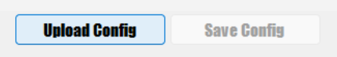

# Settings Menu

The settings screen allows you to adjust all settings for the PinOne in one place. Once you have adjusted the settings, click the "Save Config" button to save them on the PinOne. Once you save the changes, even if the USB cable is disconnected from the PinOne then your changes will be restored.

