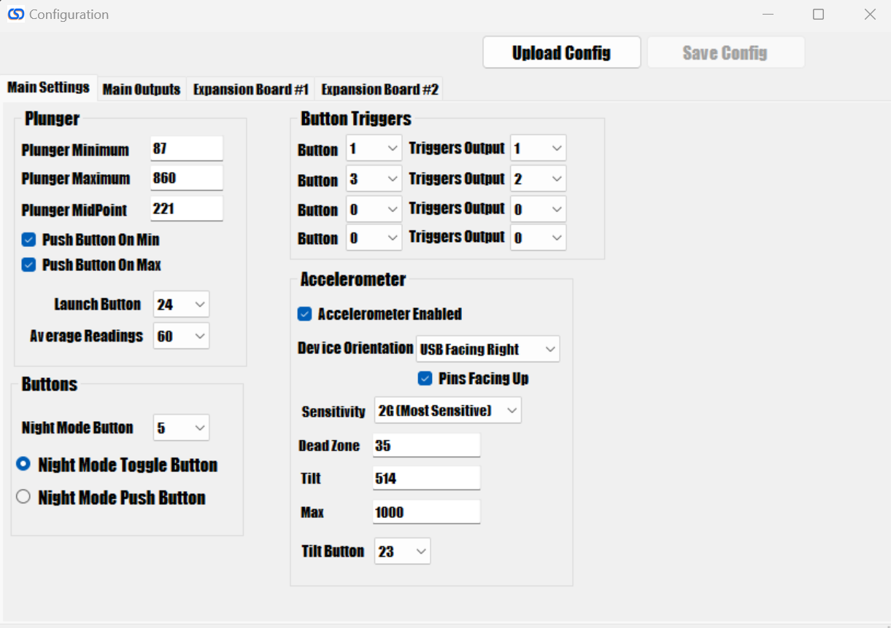

# Main Settings

## Plunger Settings

If you want to adjust the raw plunger values, this is where it can be done. It is recommended to set these values in the [plunger menu](../plunger) so only adjust here if you know what you are doing.

## Accelerometer Settings

Similar to the plunger settings, you can adjust the values here, but it is recommended and much easier to adjust these values via the [accelerometer menu](../accelerometer)

## Button Triggers

This allows you to tie up to 4 buttons to an output on the PinOne board. This means that if a button is activated, it will then activate the output tied to it. This feature is most useful to easily bind flipper solenoids to the flipper buttons so you can have feedback even without having any DOF support. There are other uses for this as well however, as you could use a switch to turn something on or off in the cabinet.

## Buttons

### Night Mode

This section allows you to set which button will trigger night mode as well as what type of button you are using. If you are using a toggle button, then night mode will be activated while the button is "on" and disabled when the button is "off" if using a push button, when you push the button once, night mode will be activated, and pushing the button again will disable night mode

### Shift Button

This dropdown selects which button is assigned as the "shift button" when pressing this button, buttons 5-8 will actually trigger 25-28, allowing those 4 buttons to have dual actions.

