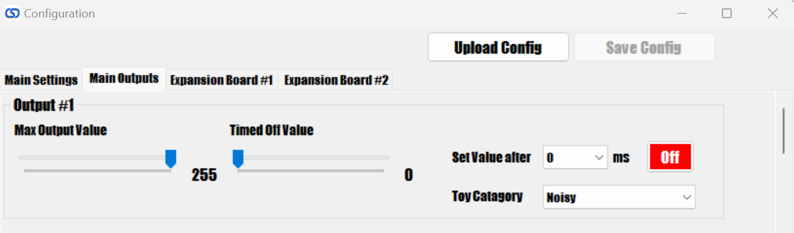

# Output Settings

There are three additional tabs in the settings menu that allow you to adjust the settings for all of the outputs available on the board. The main board has the first 31 outputs that are available on the main board, and the other two tabs are for the optional expansion boards if you have them connected.

## Max Output Value

This setting configures the absolute maximum output that will be allowed for the output, regardless of what output has been sent to the board. This will override any command given so the output will never go above this amount. This can be great for modifying the speed of a motor, or adjusting the brightness of lights. Sometimes this can also be adjusted in DOF, but it's much more convenient to set it here and just leave DOF to it's default setting.

## Timed Off Value and Set Value After

This is the value that the output will go to after the "Set Value After" time limit is reached. This means that if the value is set to 255 initially, and you have the "Set Value After" set to 1000ms, then after 1000ms, the value will change to what you have set here. This is useful for assigning "flipper logic" to solenoids or preventing LED lights from being at full brightness for too long. If you are using the life extenders, then there is no need to set this, but it can be used to turn off a solenoid that might have been left on for too long to protect it in case you don't have life extenders installed.

## Toy Category

Set this depending on the nature of the device. Below is a description of the different settings and how it affects the output:

 - **Normal** A normal output with no special considerations.
 - **Noisy** when the night mode is enabled, then the devices set to noisy will stop responding to events, thus preventing the cabinet from being noisy at night.
 - **Light Show Medium** That output will be set for the special "light show" that is available if no input our output is received by the device for a set period of time. This allows you to enjoy special effects with your lighted buttons and other lights in your setup even if you don't have DOF functioning. The "Medium" setting specifies that the lights will be at 50% intensity until a button press, which will then cause them to light up to max intensity until the button is released.
 - **Light Show High** Same as the above, only in this mode the lights will always be at 100% intensity, so pressing a button won't affect how bright it is.
 - **Shared** These outputs are also affected by night mode, but they will also share events. This is typically used with solenoids so if you have an event telling a solenoid to trigger, but that output is already enabled, it wil look to other shared outputs to trigger instead.

