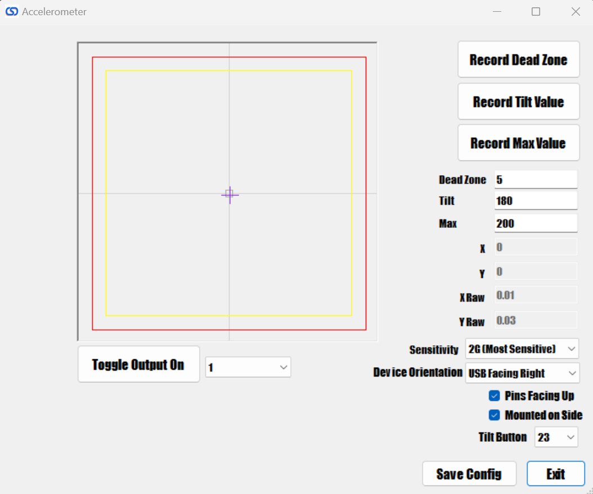

# Accelerometer

Configuring the accelerometer is fairly straight forward, but a good configuration can add a lot of realism to your pinball machine, while also preventing common issues. The first time you go to configure the accelerometer, I recommend performing the following steps:

1. Set the sensitivity to 2G. You likely will not need to modify this setting as the values from the board are always normalized.
2. Set the "Pins" checkbox correctly. When mounted to a board, the pins on the board are facing down, so the box will not be checked. When the board is mounted by itself, then the pins on the board will likely be facing upward and you will want the box to be checked. 
3. Set the orientation. The USB connection refers to where the USB plug on the board is facing when you are standing in front of the pinball machine. So if the USB connection is away from you, then you would select "USB Facing Back"
4. Click the "Record Dead Zone" button to record the values that will be ignored. The Dead Zone value is highlighted with a gray square on the accelerometer graph. This can be helpful if toys like your shaker or solenoids are activating the accelerometer. I added the ability to turn on/off your outputs from the screen so you can see how your various outputs affects the accelerometer and also to assist in automatically setting the dead zone. I've found that I prefer to set this value and keep the accelerometer more sensitive so that I don't have to aggressively shake my table to get the ball to move. It's a little less realistic than a real pinball machine, but much easier on the table. Click the "Record Dead Zone" button when you are done.
5. Use the "Record Tilt Value" button in the same way you set the Dead Zone, except you will want to move the table to a point where you would consider a tilt event occurring. This value is shown with the yellow square on the accelerometer graph. When tilt is activated, it will send an output to button 23 on the board.
6. Use the "Record Max Value" button to set the absolute maximums you would expect to receive on the accelerometer. If you want to make the accelerometer less sensitive to movement, this is actually the best item to adjust. You can set this to a much higher number manually and it will restrict the overall sensitivity to accelerometer events sent.