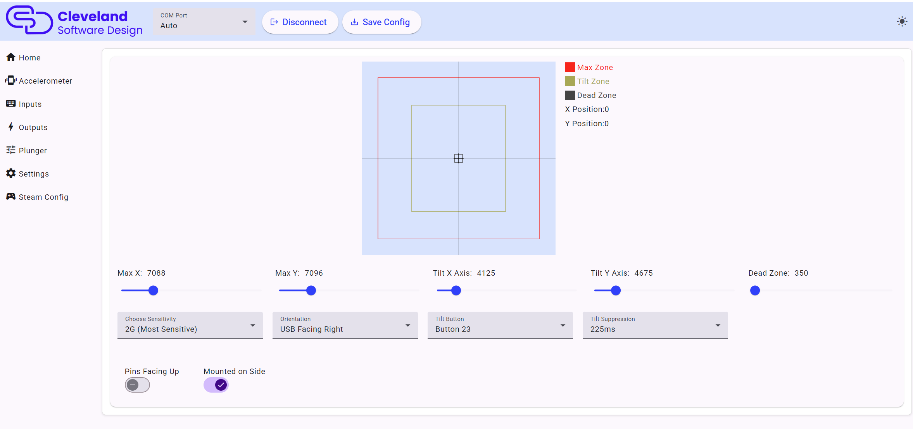

# Accelerometer

Configuring the accelerometer is fairly straight forward, but a good configuration can add a lot of realism to your pinball machine, while also preventing common issues. The first time you go to configure the accelerometer, I recommend performing the following steps:

### Setting sensitivity

2G is the most sensitive setting. At this setting, small nudges will make big impacts in the cursor. You can reduce the sensitivity to make the nudges have less effect, or you can also simply change the max value as another way to adjust the accelerometer sensitivity. 

### Setting the Pins checkbox

Set the "Pins" checkbox correctly. When mounted to a board, the pins on the board are facing down, so the box will not be checked. When the board is mounted by itself, then the pins on the board will likely be facing upward and you will want the box to be checked.
If the board is mounted on its side (like it is on the PinOne Mini Machine) then you will check the box "mounted on side"

### Setting the orientation

Set the orientation. The USB connection refers to where the USB plug on the board is facing when you are standing in front of the pinball machine. So if the USB connection is away from you, then you would select "USB Facing Back"

### Setting the dead zone

Use the slider to set the dead zone. I've found the dead zone is typically going to be a small number, less than 10 in most cases. The Dead Zone value is highlighted with a gray square on the accelerometer graph. This can be helpful if toys like your shaker or solenoids are activating the accelerometer, and also to improve performance of the PinOne board by only sending accelerometer events when they are actually happening.

### Recording the Tilt Value

Use the tilt value sliders to set your tilt on the table to a point where you would consider a tilt event occurring. This value is shown with the yellow square on the accelerometer graph. When tilt is activated, it will send an output to the button selected in the "tilt button" dropdowns.

### Recording the Max Value

Use the max value slider to set the absolute maximums you would expect to receive on the accelerometer. If you want to make the accelerometer less sensitive to movement, this is actually the best item to adjust. You can set this to a much higher number manually and it will restrict the overall sensitivity to accelerometer events sent.

### Setting tilt buttons

You can set a different tilt button for each of the four x/y boundaries. This can be helpful if you want to use keyboard like nudging but still use the accelerometer to send the events. In VPX you might want to set the same button for all four boundaries. You cannot set the button mapping unless the "tilt enabled" checkbox is checked.

## Setting Tilt in VPX

In VPX, you need to configure the tilt to use a real tilt bob (even though the PinOne is simulated, it will work just as good as a real tilt bob) in order to do this, you need to take the following steps:

1. Navigate to your visual pinball scripts folder. Typically `C:\Visual Pinball\Scripts`
2. Find the file named `NudgePlugIn_mjrAccelAndTilt.vbs` and rename it to `NudgePlugIn.vbs` This will ensure that the tilt from the PinOne board does not cause a real tilt event on the table and also counts the tilt event properly towards a mechanical tilt. 