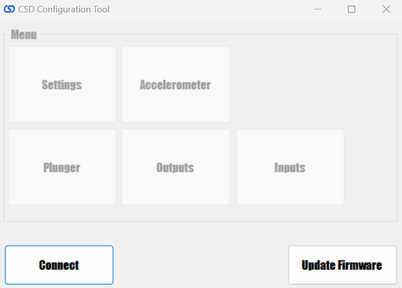
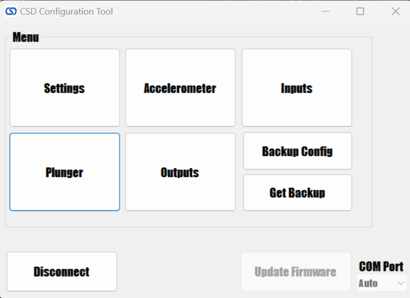

# PinOne Configuration Tool

### Download the config tool here

Configuring the PinOne board is designed to be extremely simple. Just plug the board into your PC via a USB connection and run the configuration utility. The most recent version can always be fetched directly [here](./files/CSDControllerTool.zip) Once running, click the `connect` button and you should see all the options appear on the menu so you can easily test and configure the board.

Clicking connect should result in the window updating as shown:

You can now access all the menus available to test and configure the PinOne board. You can also save a backup of the settings changes in case you need to replace your board in the future.