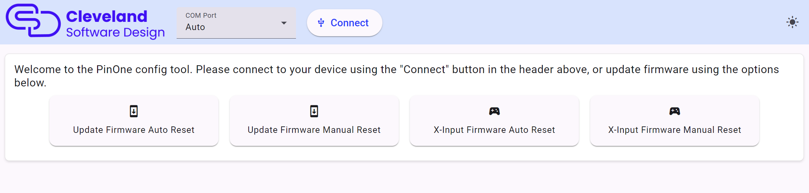

# PinOne Configuration Tool

### Download the config tool here

Note, when upgrading from 1.18, you need to adjust your accelerometer as the new firmware updates the accelerometer to use raw values, which affects scaling

Configuring the PinOne board is designed to be extremely simple. Just plug the board into your PC via a USB connection and run the configuration utility. The most recent version can always be fetched directly [here](https://github.com/philipellisis/arduino-virtual-pinball-board/releases/download/v1.19.1/pinone-config-tool.1.19.1.exe) Once running, click the `connect` button and you should see all the options appear on the side menu so you can easily test and configure the board.

Clicking connect should result in the window updating as shown:

You can now access all the menus available to test and configure the PinOne board. You can also save a backup of the settings changes in case you need to replace your board in the future.

### Updating Firmware

Before you connect to the board. You are presented with four options to update the firmware. This is not something you need to do on a newly purchased board as it should already have the latest firmware installed on it.

1. The first option is to `Update firmware Auto Reset` This option will work on boards with a USB C type connection sold after December of 2024. If you have a newer board you can just click this button to install the firmware. 

2. The second option is the `Update Firmware Manual Reset` With this option, you need to first press the reset button on the PinOne board, then quickly select the COM port that displays and click the button to update the firmware. You have about 5 seconds from the time you click the reset button to the time you need to click the button.

3. The third option is just like the first, but it installs the X-Input firmware. This is if you do not care to use all the DOF configuration tool features and just want a game controller that works with steam and VPX without any hassle. Just make sure your plunger and accelerometer are calibrated to your liking before installing this firmware as you cannot run the config tool anymore after doing this.

4. This installs the X-Input firmware in the same way option 2 above does. 

### Installing firmware on boards with X-Input installed

If you are on a newer version of the PinOne board with the USB C port, you can reset the board if it is in X-Input mode by pressing buttons 3-9 all at the same time. On the PinOne Mini Machine, this is all the buttons except for the two on the right side of the machine. Once you reset the board, you can then install the original firmware by using option 2 above.

### Backing up and Restoring Configurations

Once you connect to the board, there is an option to backup and restore a configuration for your PinOne board. In case you ever need to replace your PinOne board due to failure, having a backup of your configuration can make replacing it a bit easier.