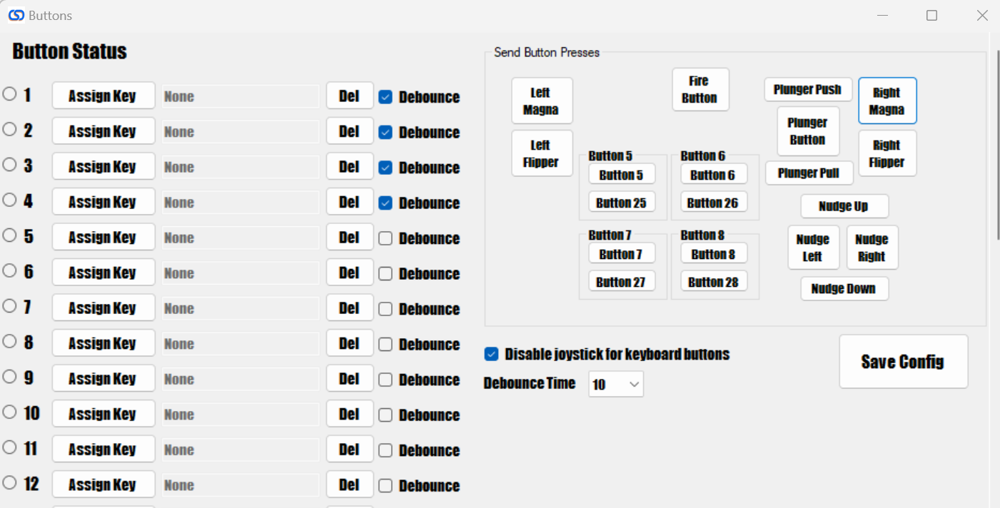

# Inputs

## Send button presses

Besides the obvious of being able to see button presses made in the PinOne board when in this screen, it also provides a way to send button inputs out to the computer that are not generally easy to send like the accelerometer left, right, up, down, and the plunger up, down as well as the plunger button press if configured. This allows you to setup the PinOne board in steam and properly assign inputs to each of the different controller functions.
