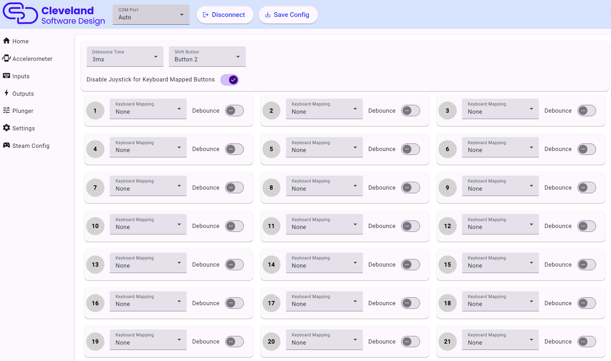

# Inputs

### Shift Button

This dropdown selects which button is assigned as the "shift button" when pressing this button, buttons 5-8 will actually trigger 25-28, allowing those 4 buttons to have dual actions.

## Steam calibration text

Besides the obvious of being able to see button presses made in the PinOne board when in this screen, it also provides a way to generate a steam calibration file that can be used to directly map the buttons of the PinOne to a Steam controller. Just set the buttons the way you want them to work in steam and paste the text shown into steam during the calibration phase. Now you can also save the configuration directly to your Steam .vdf file so there is no need to do any calibration in steam at all!

## Send Keyboard Presses

Next to each button is the option to set a keyboard keypress for each button input. When set, this will send a keyboard keystroke as well as the button press with each press of a button. This can be helpful for games that don't support a game controller or if you want to use a standard set of keys with the PinOne. To use this feature, click the button next to the button you want to activate, and then use a keyboard to record the keystroke you want to simulate on the PinOne.

## Debounce

This can be set for buttons in case you don't want them to be as sensitive to fast button presses. This is not recommended for the flipper buttons but can be helpful for some of the menu buttons to prevent accidentally double tapping them.