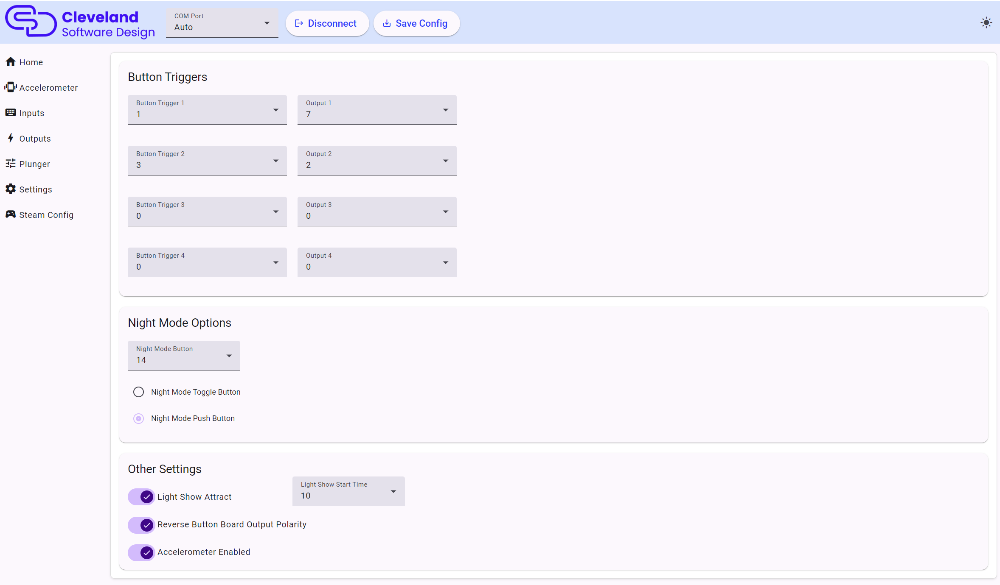

# Settings

## Button Triggers

This allows you to tie up to 4 buttons to an output on the PinOne board. This means that if a button is activated, it will then activate the output tied to it. This feature is most useful to easily bind flipper solenoids to the flipper buttons so you can have feedback even without having any DOF support. There are other uses for this as well however, as you could use a switch to turn something on or off in the cabinet.

### Night Mode Options

This section allows you to set which button will trigger night mode as well as what type of button you are using. If you are using a toggle button, then night mode will be activated while the button is "on" and disabled when the button is "off" if using a push button, when you push the button once, night mode will be activated, and pushing the button again will disable night mode

### Other Settings

This section is used to configure some additional global options on the PinOne board. You can turn on/off the light show attract, which is the pulsing of the lights on and off after a set period of time, which can also be set with the light show start time dropdown. Reversing of the polarity for the button boards should always be turned on to ensure proper operation of the button lights, but can be reversed in case you want to use those outputs for something else.

