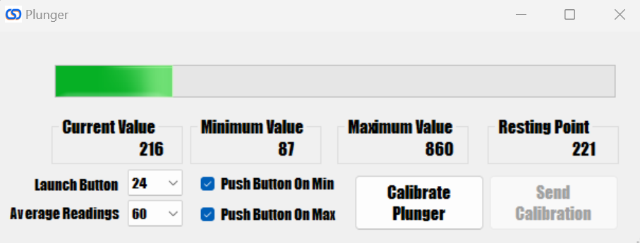

# Plunger

## Test and Calibrate

To test and calibrate your plunger, simply push the "calibrate plunger" button, move the plunger up and down to set the maximum and minimum properly. After 5 seconds a dialog will appear telling you to leave the plunger in the resting position to automatically set the "resting point" box after you click "OK". Once set, all you need to do is click the "Send Calibration" button to set the calibration. Once set, you shouldn't need to redo the calibration unless you notice something not working properly.

## Set to auto push the "Launch Ball" button

The "Push button on min" and "Push button on max" checkboxes allow you to push the button set in the "launch button" dropdown whenever the plunger gets close to the min value or the max value or for both of them. This allows you to auto launch the ball in games that don't support the plunger or use the plunger to push a button when pressed in all the way. The disadvantage of pushing the button "on max" is that when you pull the plunger all the way back, it will push the launch button. In games that support the plunger it will release the plunger and shoot the ball if you move the plunger all the way back and then forward again. This is normally not a big deal but something to be aware of. This feature is really nice when you have kids playing pinball who just want to pull the plunger and still want the ball to shoot on all games. It still allows for the skill shot feature to be used, but you are not going to be able to move the plunger slowly back to start once you pull it all the way back.

## Average readings

You should set this number to a high enough value to ensure enough readings are being averaged when reading the plunger position before sending the value to the encoder. Usually around 10-20 average readings is enough. Because the averaging happens extremely fast, setting this to a higher value will not affect performance of the board in any noticeable way, so set it to a value that is high enough to prevent any jitter in the plunger.

## Disable Plunger When Not Moving

This setting will ignore small plunger movements when it isn't actively moving and in its resting position. This can improve latency by a small amount when actively playing a game and using the flippers, but in systems where there is excessive noise in the USB ground, it could cause the plunger to unexpectedly move during gameplay which can be distracting and disable the accelerometer if the setting is enabled. If you experience this, then it is recommended to turn this off and instead rely on the plunger average readings to stabilize the plunger.

## Plunger Quick Release

This setting will cause the plunger to immediately move from the held position to minimum position when released. This can be helpful in some VPX games where the plunger movement can cause some games to have unreliable releases. When setting this, make sure you have the "Launch button" set in both VPX and in the config tool as this feature actually utilizes the VPX launch button to send the ball at the exact moment you release the plunger.

## Disable Accelerometer on Movement

This setting will disable the accelerometer when the plunger is actively moving. This can be helpful if releasing the plunger causes the ball to change movement due to the accelerometer being triggered.