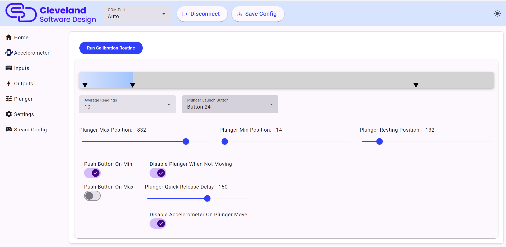

# Plunger

## Test and Calibrate

To test and calibrate your plunger, simply move the plunger up and down to set the maximum and minimum properly. Leaving the plunger in the resting position with no movement for 5 seconds will automatically set the "resting point" box. Once set, all you need to do is click the "Send Calibration" button to set the calibration. Once set, you shouldn't need to redo the calibration unless you notice something not working properly.

## Set to auto push the "Launch Ball" button

The "Push button on min" and "Push button on max" checkboxes allow you to push button 24 whenever the plunger gets close to the min value or the max value or for both of them. This allows you to auto launch the ball in games that don't support the plunger. The disadvantage of pushing the button "on max" is that when you pull the plunger all the way back, it will push the launch button. In games that support the plunger it will release the plunger and shoot the ball if you move the plunger all the way back and then forward again. This is normally not a big deal but something to be aware of. This feature is really nice when you have kids playing pinball who just want to pull the plunger and still want the ball to shoot on all games. It still allows for the skill shot feature to be used, but you are not going to be able to move the plunger slowly back to start once you pull it all the way back.