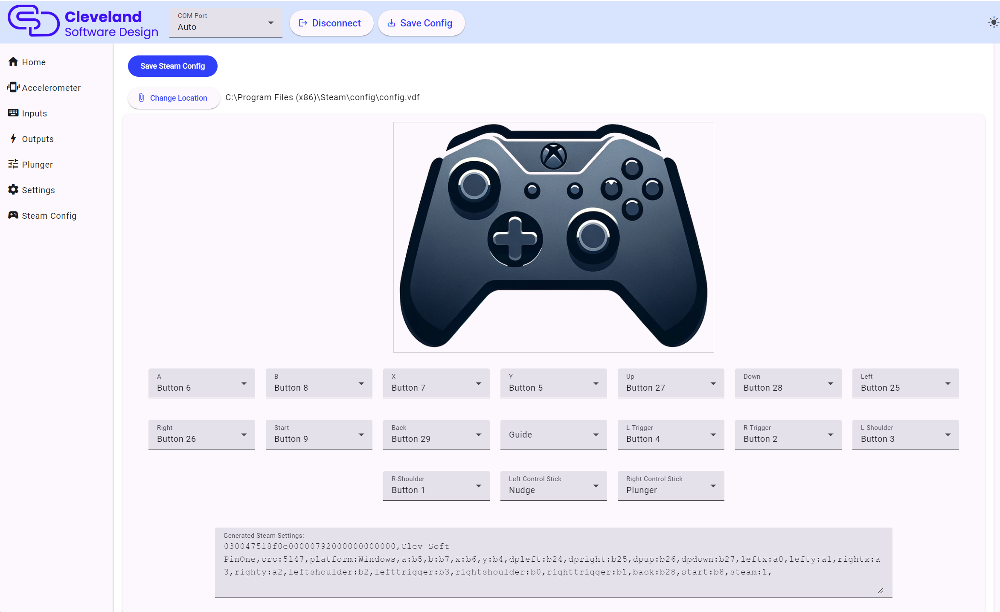

# Steam

## Setting steam calibration

Use this box to set the buttons to a standard xbox controller that can be used to map items to Steam. Once you are done, you can click the `Save Steam Config` button to automatically save the configuration to the steam VDF file.

## Steam calibration text

Besides the obvious of being able to see button presses made in the PinOne board when in this screen, it also provides a way to generate a steam calibration file that can be used to directly map the buttons of the PinOne to a Steam controller. Just set the buttons the way you want them to work in steam and paste the text shown into steam during the calibration phase. Now you can also save the configuration directly to your Steam .vdf file so there is no need to do any calibration in steam at all!
