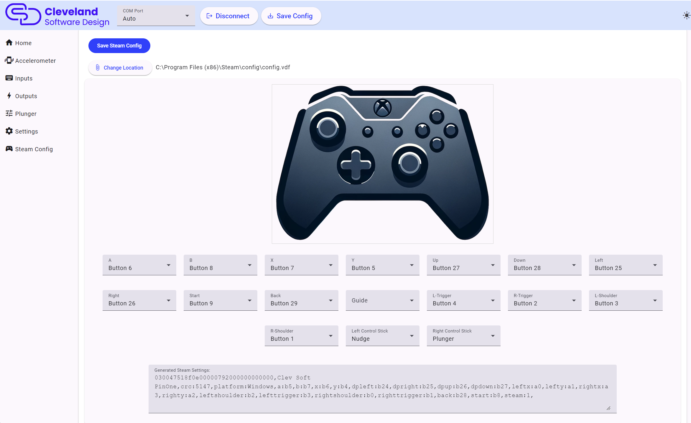

# Steam

## Setting controller calibration

Use this box to set the buttons to a standard xbox controller that can be used to map items to Steam. Once you are done, you can click the `Save Steam/Bluetooth Config` button to automatically save the configuration to the Steam VDF file and, if Bluetooth is enabled, write the button mappings to the Bluetooth board.

## Steam calibration text

Besides the obvious of being able to see button presses made in the PinOne board when in this screen, it also provides a way to generate a Steam calibration file that can be used to directly map the buttons of the PinOne to a Steam controller. Just set the buttons the way you want them to work in Steam and paste the text shown into Steam during the calibration phase. Now you can also save the configuration directly to your Steam .vdf file so there is no need to do any calibration in Steam at all!

## BLE Device Name

The Controller page also allows you to set a custom Bluetooth broadcast name for the PinOne Bluetooth board. By default, the device broadcasts as **PinOne**, but you can change this to any name up to 31 characters.

> **Note:** The Bluetooth board must be paired and connected to a device for the name change to take effect. The new name is saved to the Bluetooth board's flash storage and will persist across reboots, but requires a power cycle of the PinOne to appear with the updated name.
