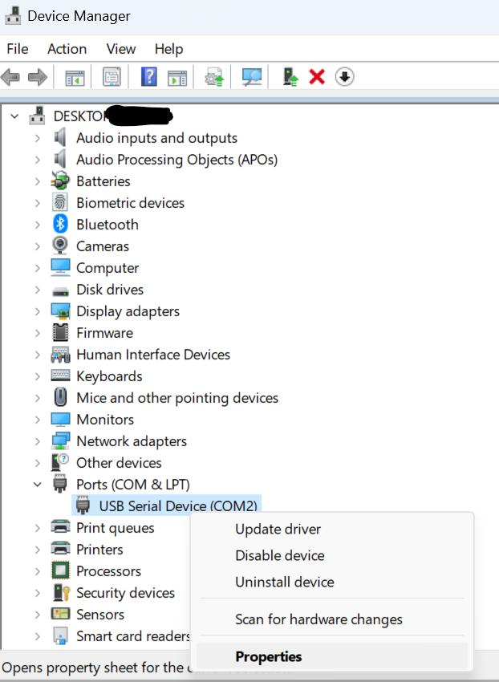
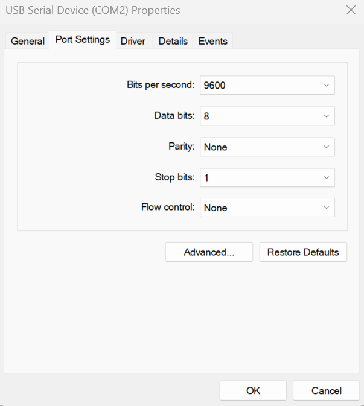

# Issues updating firmware

## How to update the firmware using the "reset" button (this is the most reliable way, if nothing else works, this will almost always work)

*** Note that if you have a PinOne board purchased after December of 2024, then you should have the newer board that can reset the PinOne automatically, so you shouldn't have to go through this process. ***

1. check the com ports that are available in the dropdown and make note of them
2. press the reset button on the PinOne board. If you don't know where it is, it is highlighted on [this page](../../Products/PinOne-Control-Board#hooking-it-up) 
3. make note of the new com port that has been added to the dropdown list
4. press the reset button again and within 5 seconds, select the new com port and press the `Update Firmware Manual Reset` 
5. Watch as the firmware updates successfully this time.

### Re-assign the COM port in windows:

go to device manager and find the device for the COM port, right click on the COM port and select "properties"

Next, navigate to the "port settings" tab and click "advanced"

Finally, re-assign a new, unused COM port, unplug the PinOne, restart the Config Tool software, and try updating the firmware again

