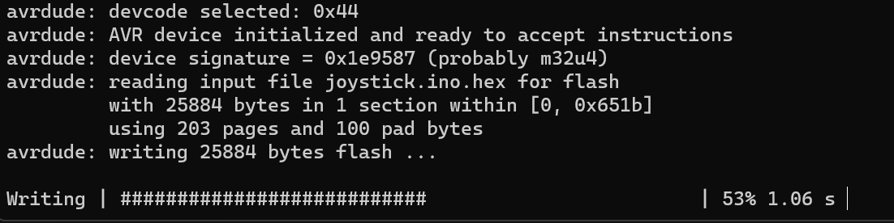
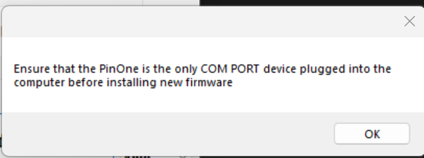

# Issues updating firmware

When updating the firmware, when you see an image like the following, then you can be sure it has successfully updated:

If you aren't seeing that dialog, then see the sections below for getting the firmware to upload.

One way I've seen that causes the PinOne to almost always take a firmware update is to do the following:
1. click the `Update Firmware` button, 
2. wait for the dialog where it says "Ensure you have one PinOne ..." and unplug the PinOne
3. Plug the PinOne in and wait for the windows notification sound that a USB device has been plugged in (or just wait half a second) and immediately press the "OK" button on the dialog
4. Hopefully the firmware will now successfully update

## How to update the firmware using the "reset" button (this is the most reliable way, if nothing else works, this will almost always work)

1. check the com ports that are available in the dropdown and make note of them
2. press the reset button on the PinOne board. If you don't know where it is, it is highlighted on [this page](../../Products/PinOne-Control-Board#hooking-it-up)
3. make note of the new com port that has been added to the dropdown list and select it
4. press the reset button again, and within 5 seconds use the context "Advanced -> update firmware with reset button" option
5. Watch as the firmware updates successfully this time.

## When clicking the "Update firmware" button, nothing seems to happen

If you are having trouble updating the firmware on your system, sometimes the COM ports in windows can get a little mixed up and there are a few things you can do to try to resolve the issue.

1. First just try to unplug the PinOne USB cable and try again. Typically this will allow it to update
2. Next, if you still can't get it to update after unplugging the USB cable, also try to manually select the COM port in the menu when updating instead of using the "auto" option
3. Make sure the software has been unzipped and is not running in a zipped directory
4. If this still doesn't work, there are a few more things you can try:

### Re-assign the COM port in windows:

go to device manager and find the device for the COM port, right click on the COM port and select "properties"

Next, navigate to the "port settings" tab and click "advanced"

Finally, re-assign a new, unused COM port, unplug the PinOne, restart the Config Tool software, and try updating the firmware again

4. If this step does not work, the last option is to actually press the reset button on the PinOne as the Firmware is updating. This is not simple to get to in some cases, and should never actually need to happen unless somehow the firmware has gotten corrupt.

## Getting the "Ensure PinOne is the only COM PORT Error

If you see this error, then there might be other COM ports on the system, try restarting the config tool, then manually select one of the COM ports on the list to the right of the button and try again.

## Getting the "Programmer is not responding" error

This is typically caused by an incorrect COM port selected or some other error. Try restarting the config tool to refresh the COM ports that are available and try again. If you still can't get it to work, then try the steps on the first part of this section.
