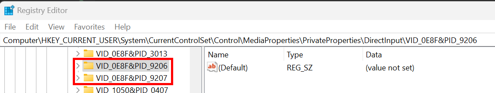
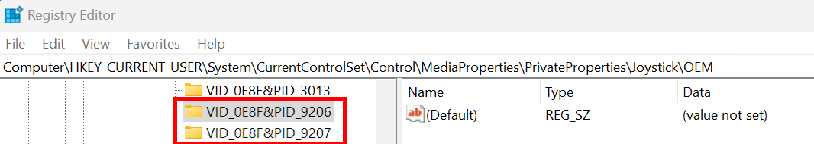

# Windows USB Game controllers

If you are having a problem where the PinOne is not being recognized properly in windows USB Game controllers, use the following steps to get it back to working order. This can happen when you upgrade the PinOne from the older game controller drivers to the newer ones.

1. Unplug the PinOne from the computer USB
2. Go to Computer\HKEY_CURRENT_USER\System\CurrentControlSet\Control\MediaProperties\PrivateProperties\DirectInput and delete the following options (if they exist):

3. Go to Computer\HKEY_CURRENT_USER\System\CurrentControlSet\Control\MediaProperties\PrivateProperties\Joystick\OEM\ and delete the following options(if they exist):

4. Plug the PinOne back in and your game controllers should now show up properly.

5. If the game controllers are still not showing up, there could be other entries with the key that need removing. You can try searching the registry for any entries matching `VID_0E8F&PID_9206` and delete all that are found.