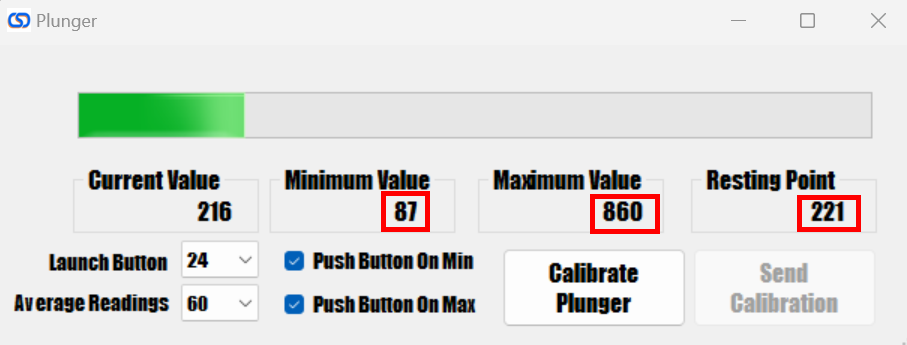
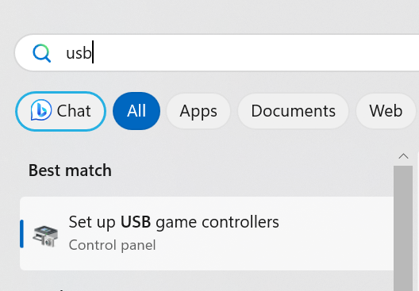
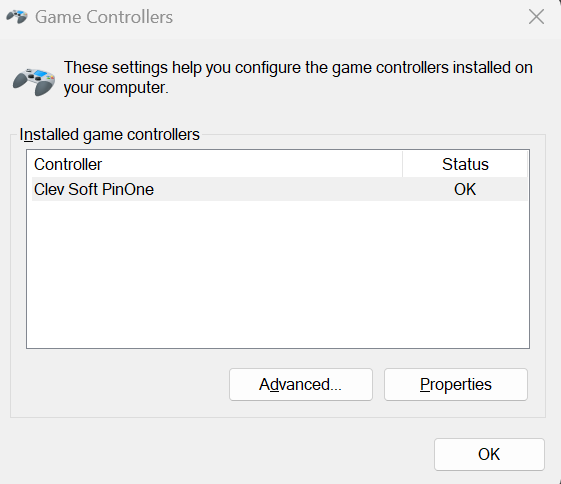
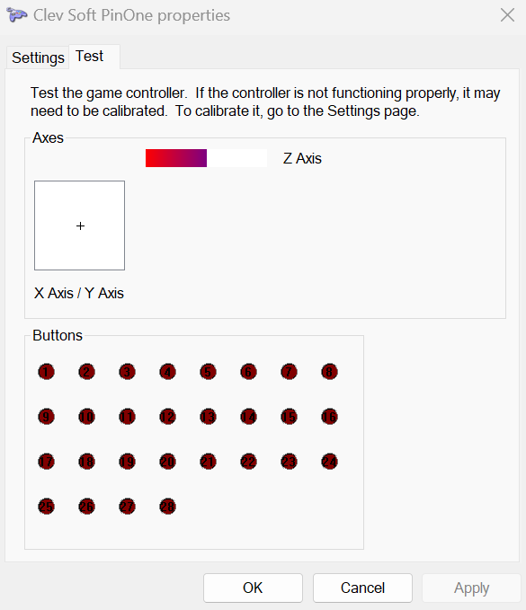

# Plunger issues 

## Plunger and/or accelerometer not moving in game

If the plunger is not moving in game, but you can see it moving fine in the config tool, then first check that the calibration is done correctly. Ensure that the MinValue is less than the resting value and that the MaxValue is also much greater than the resting value as seen in the photo below.

The plunger actually disables the accelerometer when the plunger is not at the resting position to ensure that releasing the plunger does not cause a tilt event, and it ignores plunger movement when it's sitting near the resting position to maximize response time of the buttons. In normal operation the resting position is around 200, while the min should be around 80 and the max around 800. If the resting position is the same as the min position it messes up the algorithm to detect plunger movement which causes both the accelerometer and the plunger to not behave properly.

## Checking proper operation in windows

1. Click start and type "USB Game" and click on USB Game Controllers:

2. go to properties

3. In this screen you can now test the plunger and buttons to ensure proper operation in windows.

The Z axis corrisponds to the plunger, so if you see it moving up and down with the plunger pull and release as well as sitting in the center when resting then you can be sure that the problem lies in your configuration in VisualPinball or the other applications and not in the PinOne Board.