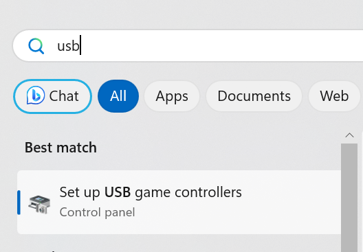
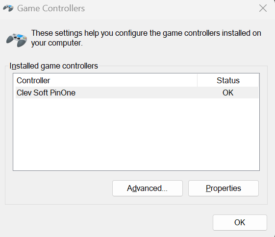
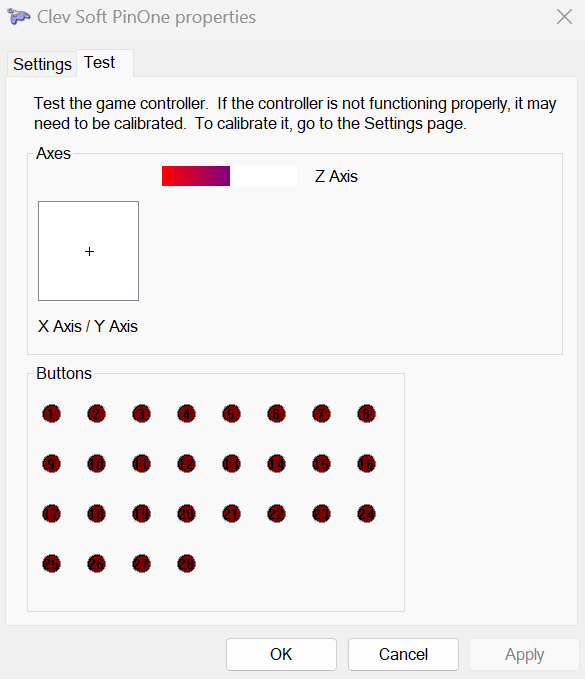

# PinUp Popper issues 

## "Invalid Floating Point Operation"

If you get the "Invalid Floating Point Operation" in Pinup Popper with a PinOne installed, it is likely due to a problem with the Z axis or the accelerometer calibration. You can fix this by going into the PinOne calibration menu, or if you don't have a plunger connected, you can simply run through the windows calibration to set everything correctly:

1. Click start and type "USB Game" and click on USB Game Controllers:

2. go to properties

3. Verify that the plunger is maxed out (z axis)

4. Go to the settings table and click calibrate

5. Run through all the calibration steps. For the accelerometer, you will want to move the accelerometer to all the extremes by nudging the cabinet to ensure the sensor is set properly in windows. For the plunger there is no need to do anything since it is not connected.

6. verify that the plunger is now set in the middle and the error should now be gone when opening Popper

