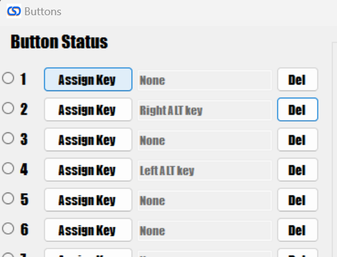

# Pinball FX Calibration

Before you can use the controller in Pinball FX, you first need to configure the controller in Steam. You can do that by following the instructions [here](./steam-calibration)

1. In Pinball FX, all you need to do is set the controller as show below and you plunger nudge and all buttons should work as desired:

2. If you want to also setup the controller to use the magna save buttons as the nudge, you can do that by assigning alt buttons to the controller using the config tool:

3. Then just make sure that the alt buttons are set for nudge left and right in Pinball FX (They should be as that is the default behavior)

