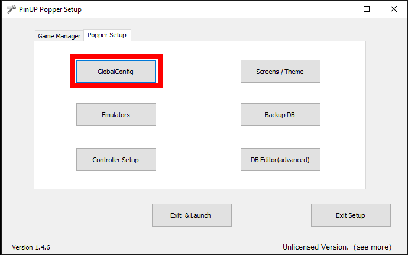
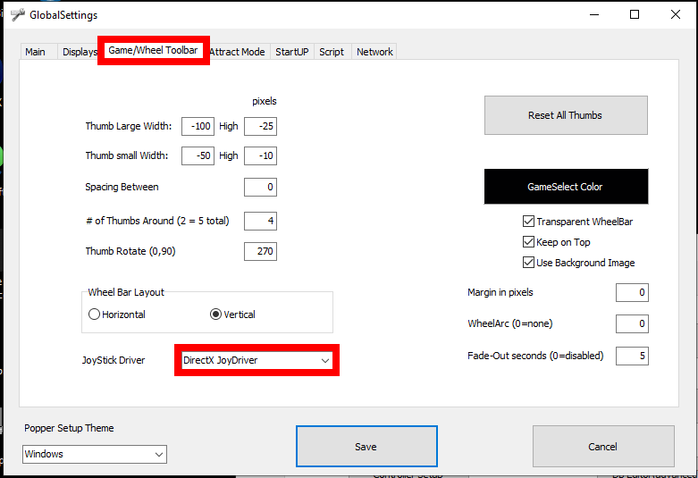
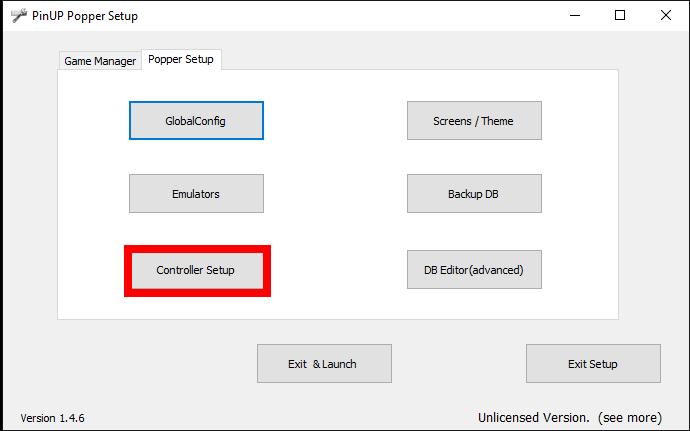
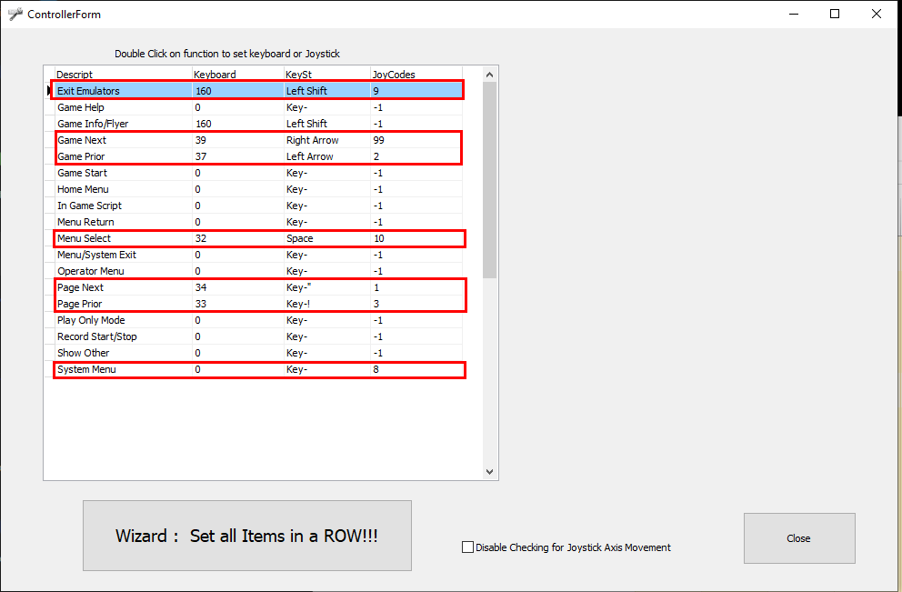

# Pinup Popper Setup

To set up the PinOne with [Pinup Popper](https://www.nailbuster.com/wikipinup/doku.php?id=start), you simply need to enter the config screen and follow the below steps:

### Global Config Settings (GlobalConfig)

Go to the Global config menu and select the DirectX JoyDriver

### Controller menu navigation (Controller Setup)

In order to properly navigate through the menus I have highlighted the buttons that are needed. There are other shortcut buttons that can be utilized, but I have found most of these options just overcomplicate navigation. All you really need is a button to select, a button to exit and a button to navigate around. For more complex setups more menu options might be necessary. 

