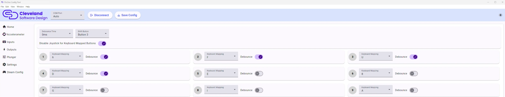

# Meta Quest VR

To use the PinOne controller with the Meta Quest 3 VR headset, you can map the buttons as keyboard inputs as shown below:

A: Nudge Up

S: Nudge Down

D: Nudge Right

F: Nudge Left

U: Left Flipper

6: Right Flipper

I: Pause

8: Launch Ball

Special thanks to DR_HVAC for finding this solution. You can find his post and give him an upvote here: https://www.reddit.com/r/virtualpinball/comments/1l20y2z/success_pinball_fx_vr_with_pinone_mini/