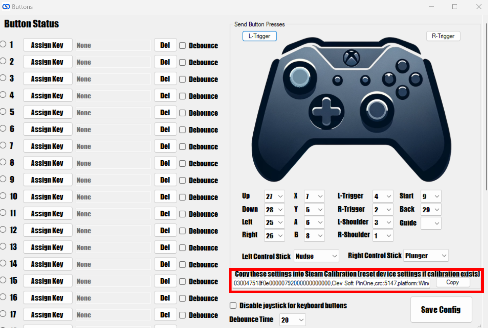
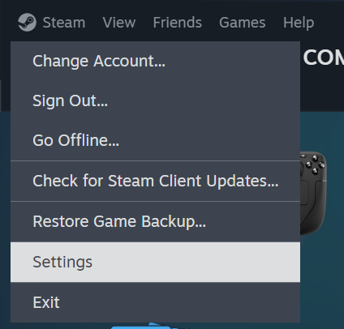
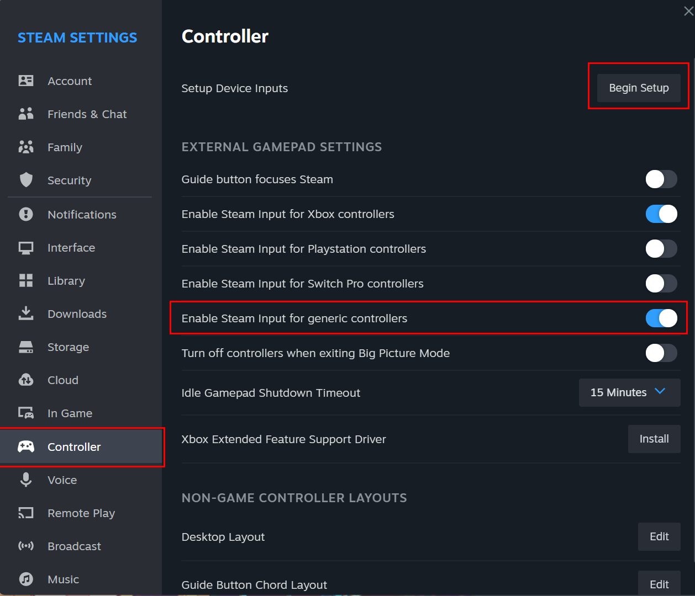
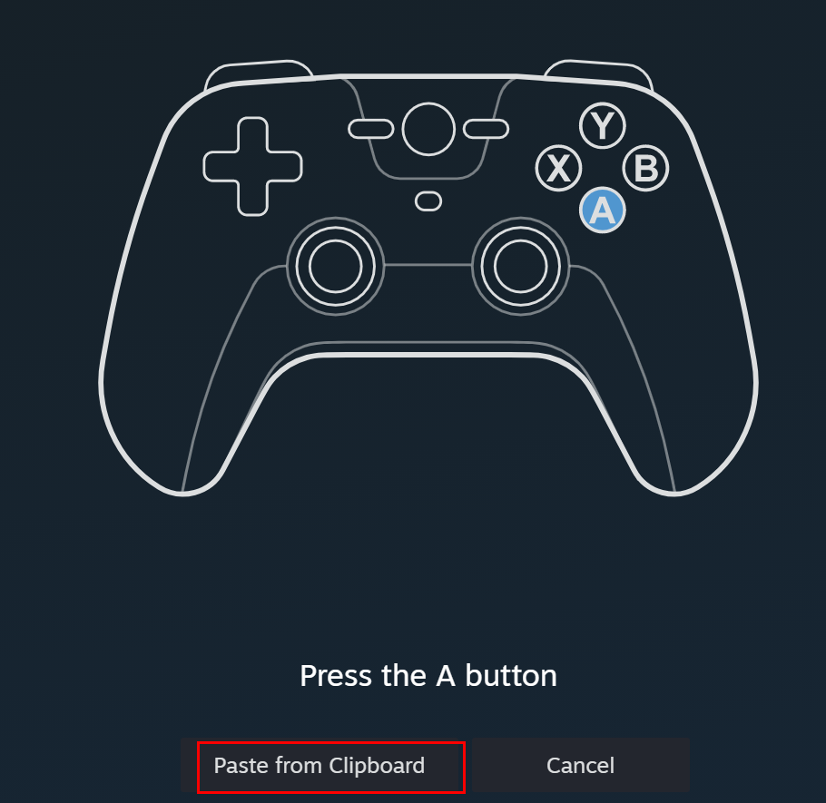
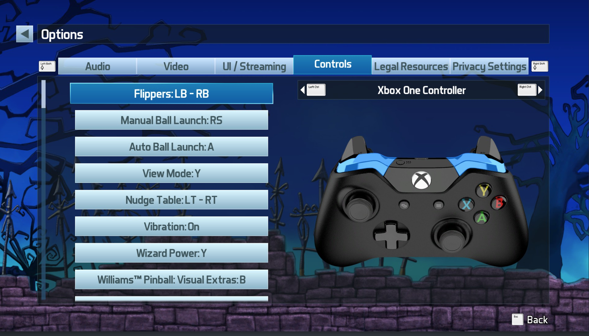

# Steam Calibration

To use the PinOne controller with Steam, all you need to do is create a Steam controller mapping and click the save button to update your Steam VDF file or set it up as a generic controller and paste the configuration into the Steam calibration screen. To do this, follow these steps:

## Create your Steam Game controller configuration using the PinOne Configuration tool Input screen:

1. Download the config tool from [here](https://github.com/philipellisis/arduino-virtual-pinball-board/releases/download/v1.19.0/pinone-config-tool.1.19.0.exe)
2. Connect to the PinOne board and navigate to the "Steam Config" screen
3. Use the dropdowns to assign the correct button to the XBox controller shown on the page.
4. Once you have setup the controller the way you like, you can click the save button to save the controller configuration into Steam. At this point you are done and can start Steam and the PinOne should be recognized. If it isn't there ready to test, then you likely need to exit Steam and click the button to save the file again.
5. If you would prefer to manually update the calibration in Steam, you can copy the configuration to use inside the Steam calibration menu (shown below)



## Configure and calibrate the controller in Steam (currently not working due to a bug in Steam)

1. Go to Steam settings:



2. Select Controller, enable generic controllers, and click "begin setup". If the controller is already setup, you can click "begin test" then "reset device settings" to start over again.



3. In the controller setup, you can use the values found with the config tool to paste into the screen, or if you want to use a pre-configured 9 button setup, you can simply paste the command below:

```
030047518f0e00000792000000000000,Clev Soft PinOne,crc:5147,platform:Windows,a:b5,b:b7,x:b6,y:b4,dpleft:b26,dpright:b27,dpup:b24,dpdown:b25,leftx:a0,lefty:a1,righty:a2,leftshoulder:b2,lefttrigger:b3,rightshoulder:b0,righttrigger:b1,back:b28,start:b8,steam:1,
```

:::note

Recently, I have gotten reports of a bug in the Steam controller calibration that does not allow the "paste from clipboard" option to work. In order to bypass this bug, you can manually adjust the "config.vdf" file found in "C:\Program Files (x86)\Steam\config" Instructions for this are in the next section below

:::



4. Once the configuration above is loaded into Steam, you can set the controller as shown below and all the keys should work.



## Manually update the controller configuration

In case pasting the data into Steam does not work, you can easily add the controller configuration to the Steam config file. Simply open the config file "C:\Program Files (x86)\Steam\config\config.vdf" in any text editor and add the configuration in the "SDL_GamepadBind" section. Once you have added the configuration for the controller, it will look like the text below:

```
	"SDL_GamepadBind"		"03000000de280000ff11000001000000,Steam Virtual Gamepad,a:b0,b:b1,back:b6,dpdown:h0.4,dpleft:h0.8,dpright:h0.2,dpup:h0.1,leftshoulder:b4,leftstick:b8,lefttrigger:+a2,leftx:a0,lefty:a1,rightshoulder:b5,rightstick:b9,righttrigger:-a2,rightx:a3,righty:a4,start:b7,x:b2,y:b3,platform:Windows,
03000000de280000ff11000000000000,Steam Virtual Gamepad,a:b0,b:b1,back:b6,dpdown:h0.4,dpleft:h0.8,dpright:h0.2,dpup:h0.1,leftshoulder:b4,leftstick:b8,lefttrigger:+a2,leftx:a0,lefty:a1,rightshoulder:b5,rightstick:b9,righttrigger:-a2,rightx:a3,righty:a4,start:b7,x:b2,y:b3,platform:Windows,
03000000de280000ff11000000007701,Steam Virtual Gamepad,a:b0,b:b1,back:b6,dpdown:b12,dpleft:b13,dpright:b11,dpup:b10,leftshoulder:b4,leftstick:b8,lefttrigger:a4,leftx:a1,lefty:a0~,rightshoulder:b5,rightstick:b9,righttrigger:a5,rightx:a3,righty:a2~,start:b7,x:b2,y:b3,platform:Windows,
030047518f0e00000792000000000000,Clev Soft PinOne,crc:5147,platform:Windows,a:b5,b:b7,x:b6,y:b4,dpleft:b24,dpright:b25,dpup:b26,dpdown:b27,leftx:a0,lefty:a1,righty:a2,leftshoulder:b2,lefttrigger:b3,rightshoulder:b0,righttrigger:b1,back:b28,start:b8,guide:b30,steam:1,"
	"Authentication"
	{
```

The line with the "Clev Soft PinOne" in it is the one you need to add. Make sure to check the quotes to ensure they are in the right place.