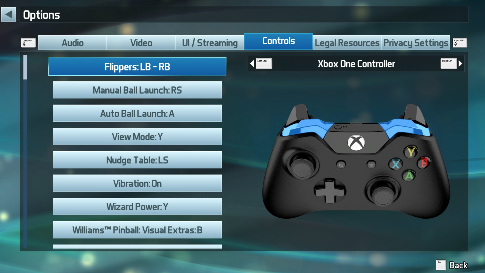

# Steam Calibration

To use the PinOne controller with Steam, all you need to do is set it up as a generic controller and paste the configuration into the Steam calibration screen. To do this, follow these steps:

## Create your Steam Game controller configuration using the PinOne Configuration tool Input screen:

1. Download the config tool from [here](https://github.com/philipellisis/virtual-pinball-board-configurator/releases/latest/download/CSDControllerTool.exe)
2. Connect to the PinOne board and navigate to the "Input" screen
3. Use the dropdowns to assign the correct button to the XBox controller shown on the page. You can also click on the appropriate button on the controller and push the button you want to assign to it as well
4. Once you have setup the controller the way you like, copy the settings shown below the controller


## Configure and calibrate the controller in steam

1. Go to Steam settings:


2. Select Controller, enable generic controllers, and click "begin setup". If the controller is already setup, you can click "begin test" then "reset device settings" to start over again.


3. In the controller setup, you can use the values found with the config tool to paste into the screen, or if you want to use a pre-configured 9 button setup, you can simply paste the command below:

```
030047518f0e00000792000000000000,Clev Soft PinOne,crc:5147,platform:Windows,a:b5,b:b7,x:b6,y:b4,dpleft:b24,dpright:b25,dpup:b26,dpdown:b27,leftx:a0,lefty:a1,righty:a2,leftshoulder:b2,lefttrigger:b3,rightshoulder:b0,righttrigger:b1,back:b28,start:b8,steam:1,
```


4. Once the configuration above is loaded into steam, you can set the controller as shown below and all the keys should work.

