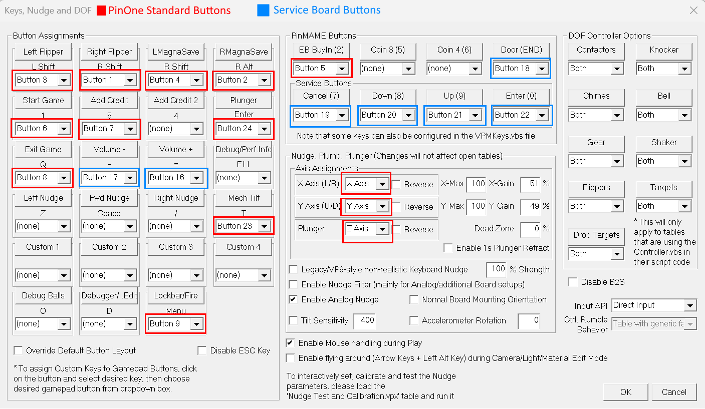

# VPX Calibration

To use the PinOne controller with VPX, configure as shown in the picture below:

1. Go to Preferences -> Configure Keys, Nudge and DOF

2. For VPX Plunger calibration, ensure you have the "Plunger quick release" enabled for the best accuracy. You can read about it [here](./Configuring/plunger#plunger-quick-release).