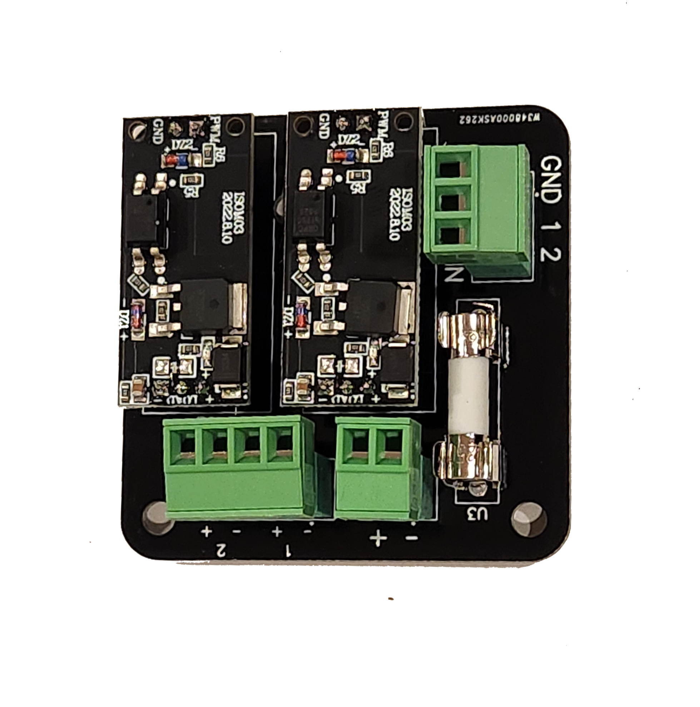
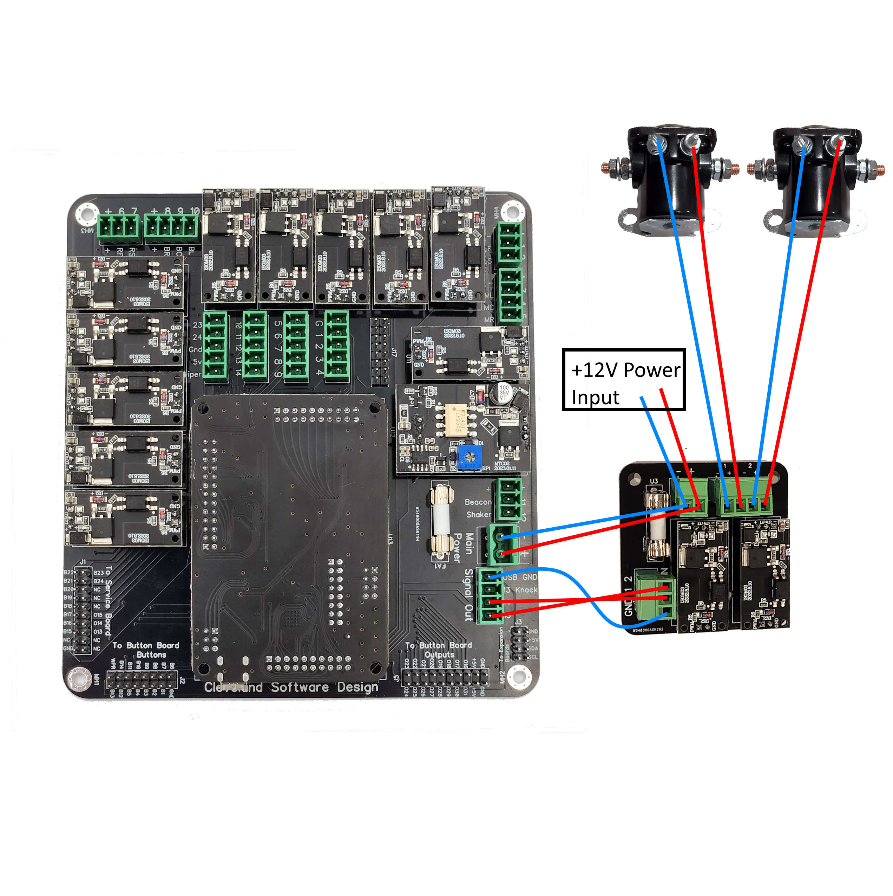

# 2 Channel Output Board

## Introduction

This just a simple board that you can use to add 2 more outputs to your PinOne Main board or really any board that has signal level outputs. It is compatible with a KL25Z, direct to the PinOne board, or any Arduino board. 

## Specifications and Features

Below are some of the features the two output board offers

 - Voltage input requirements: 5-24V DC 
 - Signal level input requirements 3.3-24v DC, only 3mA required
 - Current Requirements: 10A per channel continuous, 20A for 10% duty cycle
 - Diodes built onto outputs for protection
 - Optically isolated outputs from signal inputs
 - PWM capable signal inputs

## Hooking it all up

### Basic installation

Connecting it up is as simple as providing a low voltage input into the "signal input" side, while providing a high voltage and current source to the voltage input, then connecting the two outputs to anything you would like to run. Below is a simple diagram showing how to connect to the PinOne Main board:

