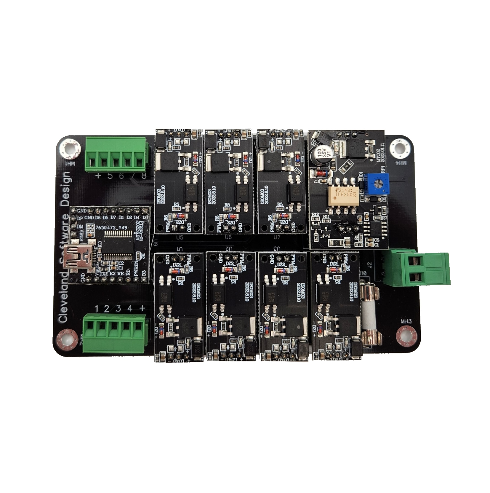
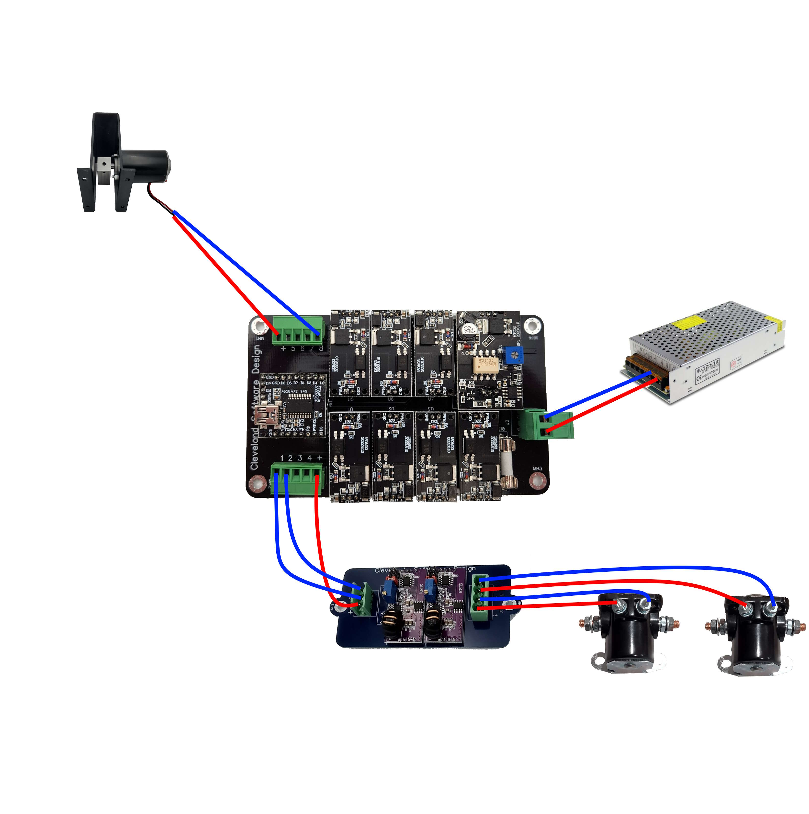

# 8 Output Relay Board

## Introduction

The 8 output board is just a simple solid state relay board that allows you to connect up to 8 devices to your cabinet. It also has a nice shaker motor controller so you can connect a shaker motor to your setup easily as well. If you find yourself in a situation where you need just 8 simple outputs but don't want to mess with an encoder or complicated configuration then this is a good option. It's fully DOF and DOFLinx compatible and is auto detected too, so it's fairly plug and play for getting it to work.

## Hooking it all up

### Connecting to the PC

Connecting to your PC is simple through a USB cable.

In case the device is not detected, the drivers are available here: [FTDI Drivers](./files/CDM21228_Setup.exe)

### Testing

Troubleshooting and manual testing:
1. download the files from here: - [Relay tester](./files/Sainsmart.zip)
2. Unzip and run the USB 8 Relay Manager v.1.4.exe to manually activate the relays

### Connecting Shaker and Solenoids or other toys

Below is a picture showing how to connect most devices to the 8 Output Board

