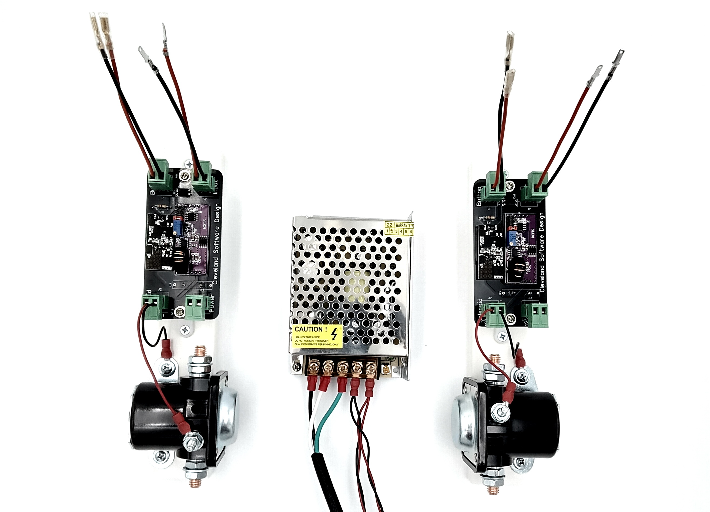
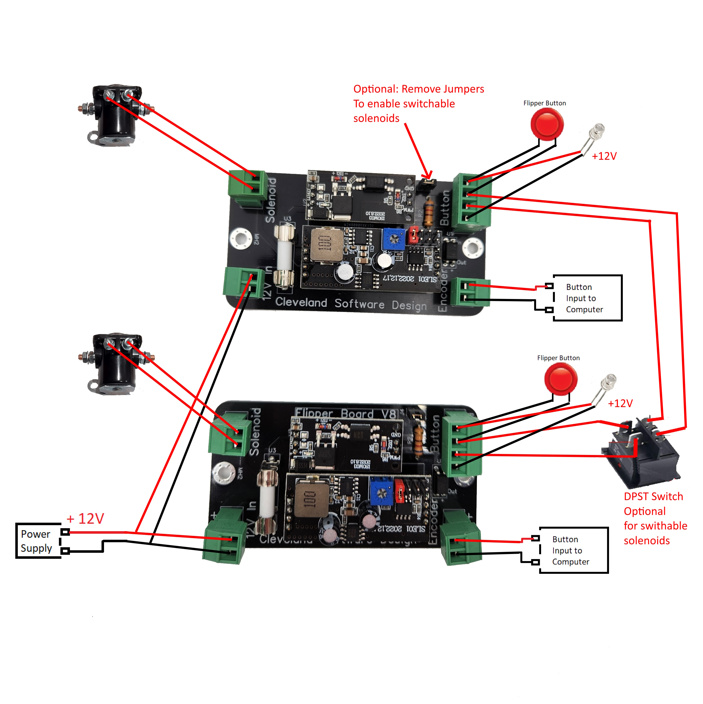
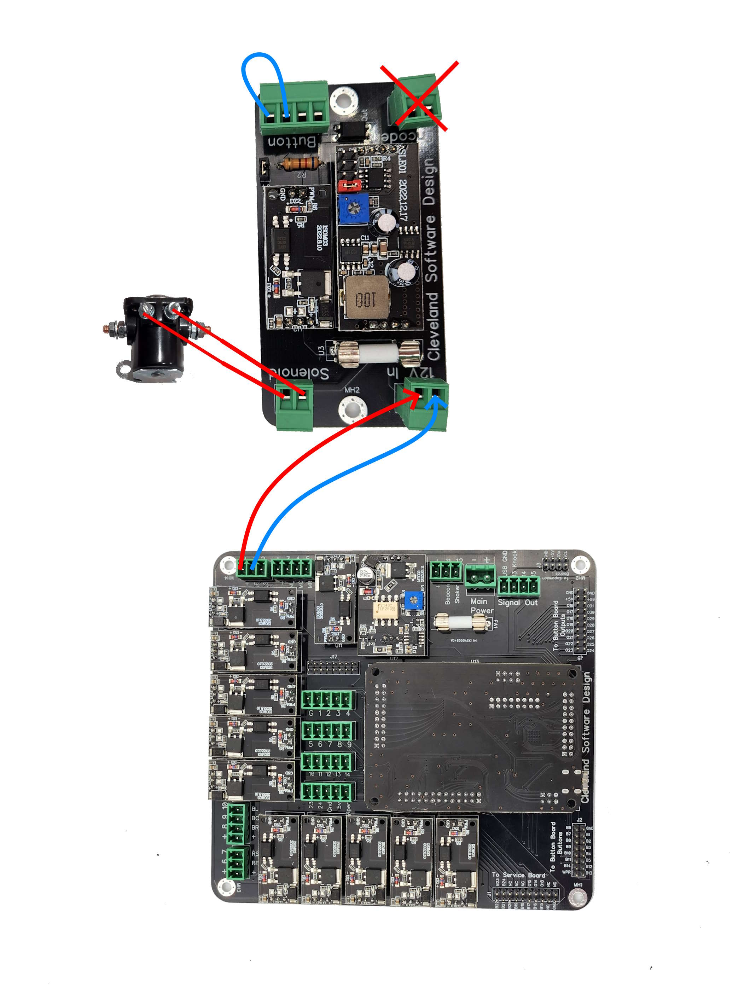

# Flipper Boards

## Introduction

The Flipper boards are a simple hardware solution that allows you to trigger high power solenoids safely from your pinball buttons and forward the signal along to your encoder. This provides flipper solenoids feedback without any software installation needed. 

## Specifications and Features

Below are some of the features and specifications for the flipper boards

 - Voltage input requirements: 5-24V DC 
 - Current Requirements: Recommended 5A power supply
 - Allows for 12v lighted button connection directly to input
 - Allows for switch to be added to enable "night mode" so that solenoids do not fire with button presses

## Hooking it all up

### Basic installation

In the most basic install you simply connect the following:

12V DC power supply: Connect to the "12V In"
Solenoid: Connect to the "Solenoid"
PC Encoder or game controller: Connect to the "Encoder"
Arcade button: Connect to the "B+" and "Be" terminals
Ensure that the jumper is in place

### Connecting an external switch to turn off the solenoid action

If you want to add a switch to turn off the solenoids, you can do the following:

Purchase a DPST switch like this one: https://www.amazon.com/Baomain-Toggle-position-mounting-terminal/dp/B01MRV5T5R
Remove the jumper and connect the switch between the "Bs" and "Be" leads.

### Adding a lighted button 

To add a lighted button to the board, you can do the following:

Connect the positive lead of the LED to the "B+" connection, and the negative lead to the "G" 

Note that this is a direct connection to the power supply, so if you are running a 24v power supply this will be 24v at these points. 

### Wiring diagram

Below is a wiring diagram showing how to connect all the options listed above

## Bypassing to run directly off the PinOne board

In case you have upgraded to the PinOne board and want to use the flipper boards just for the life extender functionality, you can bypass them by connecting a jumper to the button input and connecting one of the PinOne Main outputs directly to the power input on the flipper board. The picture below demonstrates how this can be done.

