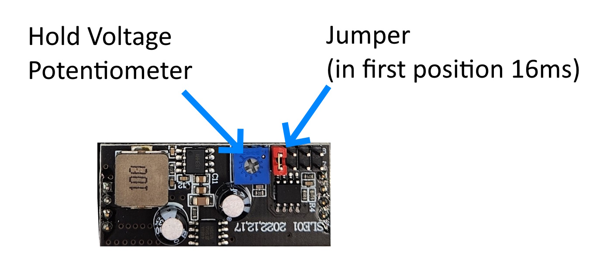

import Video from '@site/src/components/Video';

# Life Extenders

## Introduction

The CSD Life extenders are a simple electronic device that ensures your solenoids work properly over a long period of time. The process for extending the life is as follows:

1. The length of time that the solenoid will recieve full output power from the power supply is goverened by a jumper on the board. This is adjustable in steps of 16ms, 25ms, 50ms and 100ms 
2. The "hold voltage" is adjusted by a potentiometer on the board and can be adjusted from about 2v to 10v

In most cases a solenoid needs very little voltage to hold it in place, but to have the best sound and feel, the full voltage must be applied for as long as the solenoid takes to get to fully extend. For short throw solenoids it's less than 16ms but for longer solenoids it can be up to 50ms. Once the solenoid is fully extended, the voltage is instantly dropped to a level that is acceptable for it to be held in place. Typically around 2-4V. In the case of a 12V solenoid with a 3.2 ohm winding, the power requirements go from 45W to under 3W, a massive decrease and enough of a decrease to allow the solenoid to run cool, even in the most extreme operating conditions. 

Adjusting the life extender hold voltage is done by rotating the potentiometer. A clockwise motion will increase the hold voltage, and it should be adjusted so it is just above the point where the solenoid drops out while being held on.

## Why should I rely on these instead of a software solution like the flipper logic in pinscape?

- It's a hardware solution, which is much more robust than what you get with a software solution, there are multiple scenarios where the software can fail and running a solenoid at full power will cause massive overheating, and catastrophic failure is inevitable.

- These boards are much faster than what a software solution can provide. The solenoids are at full power for only 16 milliseconds on the fastest setting, that's so fast that even if you are hitting the flippers as fast as you can, they still will not overheat, that is not the case with most software logic solutions. Because the reaction is so fast, you can add a slow blow fuse that will get triggered if any solenoid happens to run at full power, which adds another layer of protection from overheating. 

- Many times you want to use the PWM outputs for other things, and this frees them up for those other things

- Since you have a hardware solution, and the reaction time is so fast, the power requirements are super low. You can run 10 solenoids off a 5A power supply and never run into problems. That by itself is a huge benefit to using the life extenders. Some people will say you don't need them for the pop bumpers, but if you don't have them, then you need a massive power supply to run all those solenoids as each one uses 3.8 amps of current. 

- The PWM on my boards are a higher frequency so you do not have the humming issue you will get when run through pinscape — these are completely silent.

## Life Extenders video showing them in action

<Video source="https://www.youtube.com/embed/ZpK8SSSue9s?si=x1Sxj-dvSgc_8-Ey"></Video>