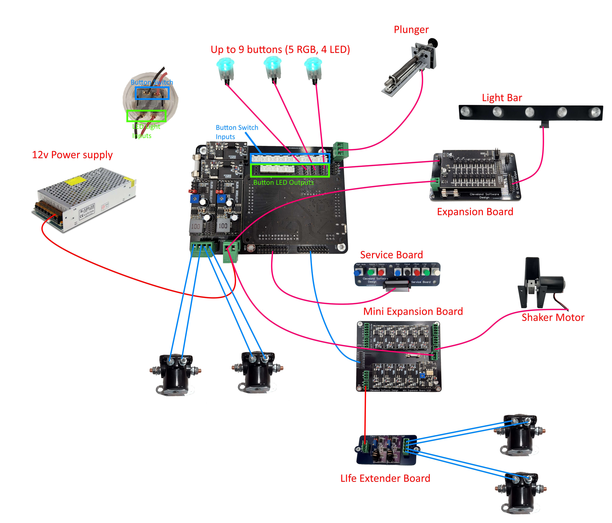

import Video from '@site/src/components/Video';

# PinOne Mini Board

## Introduction

The PinOne Mini board is a board that attaches to the PinOne and exposes many of the inputs/outputs in a way so that you can easily connect perephrials and other devices to your board. The board by itself supports the following options:

- 9 button inputs through JST-XH 2 pin plugs
- Plunger input through pluggable screw terminals
- 2 high power outputs with solenoid life extenders to connect solenoids
- JST-XH pins for lighted button outputs (5 RGB and 4 single LED buttons) -- all powered from the USB port, so no external power supply needed to operate
- Header pins for connecting the PinOne Mini expansion boards to add an additional 10 high power outputs so you can connect more toys and a shaker motor as well as an additional 4 button inputs.
- Header pins for connecting the expansion boards to power the light bar or add another bank of 16 high power outputs to your cabinet
- Header pins to easily connect the service board or add additional buttons to the PinOne
- All the normal PinOne features like nudge/tilt, and many software enabled features

## Hooking it all up

### Connecting to the PC

Connecting to your PC is simple through a USB cable. Once you plug it into the PC, you can use the configuration tool to activate all the outputs and configure the board. Unless you want to use the high power outputs, there is no need to connect a power supply

### Connecting the buttons

For the buttons, the are labeled B1 through B9. B1-4 are RGB button inputs, B5-8 are single color LED button inputs and B9 is also an RGB button input.

VPX standard inputs:

- B1 = RGB Right Flipper
- B2 = RGB Right Magna
- B3 = RGB Left Flipper
- B4 = RGB Left Magna
- B5 = Extra Ball
- B6 = Coin
- B7 = Launch Ball
- B8 = Start
- B9 = RGB Fire

### Expansion Board

The [Expansion Boards](https://www.clevelandsoftwaredesign.com/pinball-parts/p/pinone-expansion-board) are connected to the 4 pin headers labeled "to expansion board" available on the main board. There are two rows of 4 pins, but only one of them needs to be used. You can connect up to two expansion boards to a PinOne board to add an additional 32 PWM outputs. (63 outputs total)

Be sure when connecting the 4 pin wires to the expansion board that the wires are connected the right way, as you can reverse the polarity when connecting. Ensure the black wire is going to the pin labeled "GND" on both boards

The low power expansion board is required to run the [Light Bar](https://www.clevelandsoftwaredesign.com/pinball-parts/p/rgb-12v-virtual-pinball-light-bar)

### Mini Expansion board

The [PinOne Mini expansion board](https://www.clevelandsoftwaredesign.com/pinball-parts/p/pinone-mini-expansion-board) allows you to connect additional outputs to the PinOne Mini so it has all the features of the PinOne Main (except still no button board support) It adds an additional 10 high power outputs (one is reserved for the shaker motor) and 4 additional button inputs.

### Plunger

A [Plunger](https://www.clevelandsoftwaredesign.com/pinball-parts/p/virtual-pinball-plunger-attachment) can be connected directly to the mini board via the 3 pin connector where it is labeled "GND", "5V" and "WIPER" by connecting those inputs to the corrisponding inputs on the plunger board.

### Service Board

This is as simple as just connecting the 20 pin ribbon cable from the PinOne main board to the [Service Board](https://www.clevelandsoftwaredesign.com/pinball-parts/p/expansion-breakout-board-zx5y6).

### Connecting other devices

Below is a picture showing how to connect most devices to the PinOne Main board

