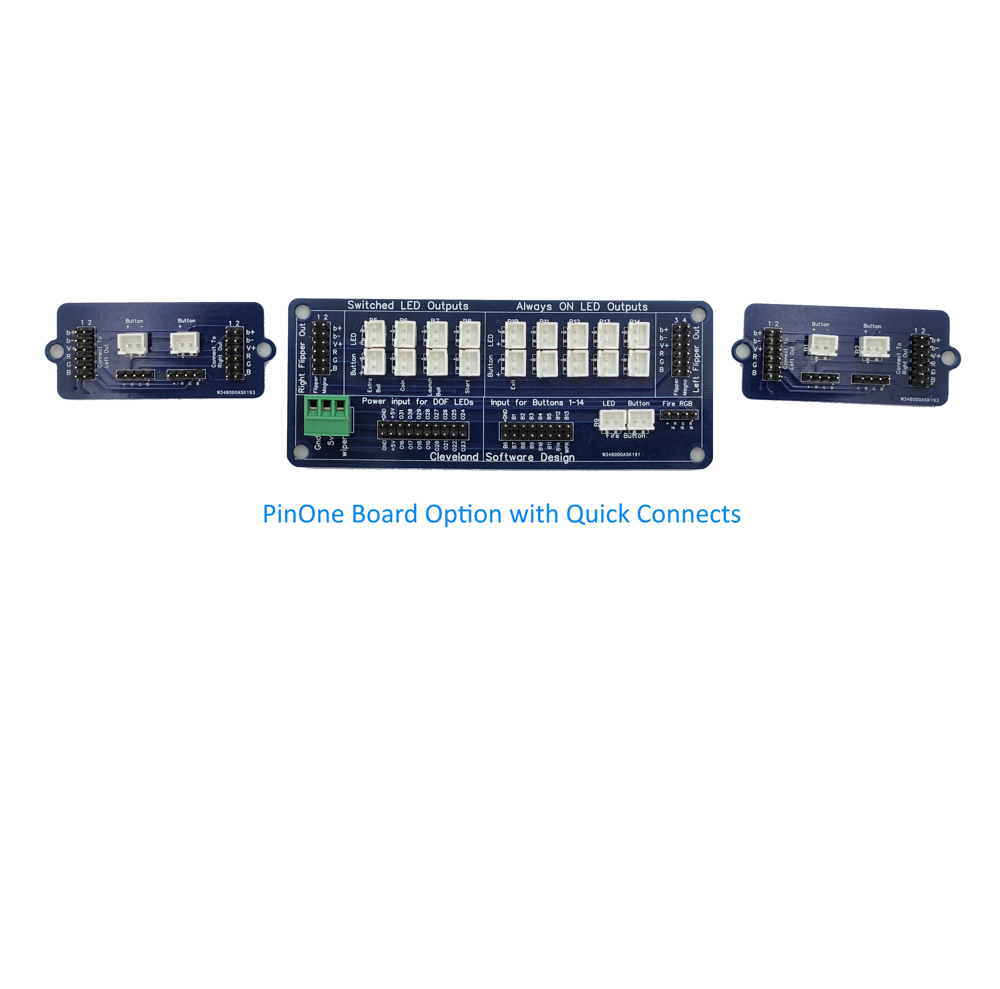

# PinOne Button Board

## Introduction

The button board connects to the PinOne main to expose 14 button inputs as well as allow for 16 low power 5v outputs to power LEDs on up to 5 RGB and 4 single color LED buttons, as well as an additional 5 "always on" buttons.

### Compatibility

The button board is only compatible with the PinOne Main board. The PinOne Mini already has button inputs/outputs exposed on the board itself. 

### Models for mounting

If you would like 3d print some models for mounting brackets, one of my customers created some nice designs from them below: 
 - [Main Board](https://makerworld.com/en/models/968832)
 - [Flipper Board](https://makerworld.com/en/models/968838)
### Hooking it all up

There is a good guide on how to connect the button board and all the buttons [here](../../BuildersKit/connecting-button-board)