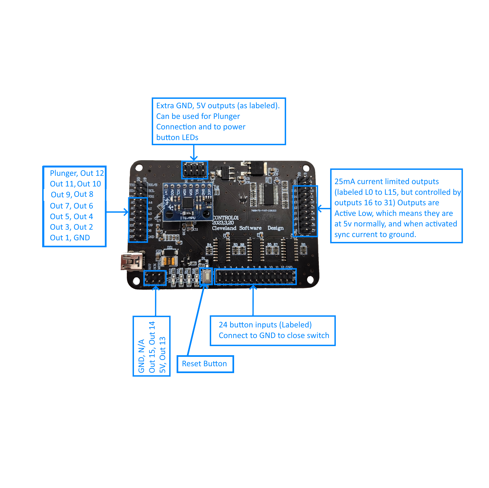

# PinOne Control Board

## Introduction

The PinOne Control Board is the "Brain" that actually runs everything. By itself it is a bit difficult to connect devices to as it only has pins that are spaced 2.54mm apart from each other throughout the board. In most cases you will want to purchase the [PinOne Mini](https://www.clevelandsoftwaredesign.com/pinball-parts/p/pinone-mini-virtual-pinball-connection-board) or the [PinOne Main Board](https://www.clevelandsoftwaredesign.com/pinball-parts/p/pinone-main-virtual-pinball-connection-board) which both come with the PinOne Control board. If you only need an accelerometer added to your cabinet or don't mind connecting devices directly to the pins on the board, then it will do nicely though. 

You can read more about the features [Here](../../PinOne/features)

The PinOne can be configured using the configuration tool that can be downloaded [Here](../../PinOne/Configuring)

## Hooking it up

Below is a diagram showing the pinouts as wel as a simple example of connecting toys to it

