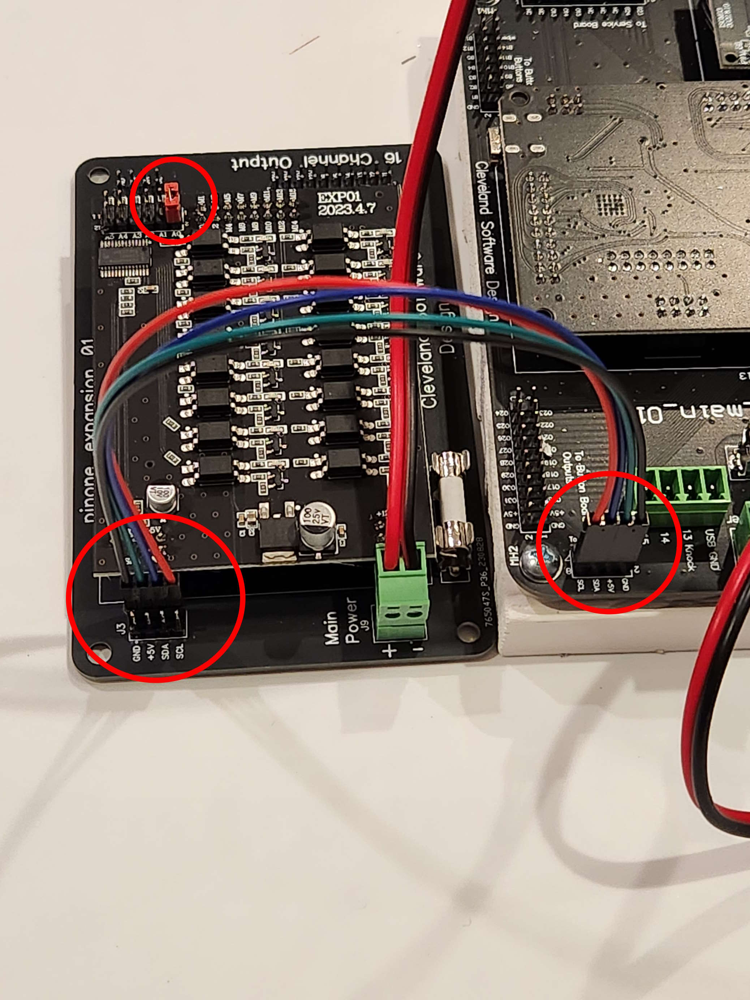

# PinOne Expansion Board

## Introduction

The expansion board allows you to connect a light bar easily to the PinOne Main or PinOne Mini. It's mainly used for this purpose as it delivers 16 1a PWM outputs, but the only way to connect anything to it is through the header pins.

The High power expansion board allows you to connect 16 additional high power devices to the PinOne board

### Compatibility

The expansion board works with all the PinOne boards

### Models for mounting

If you would like 3d print some models for mounting brackets, one of my customers created some nice designs from them below: 
 - [Expansion Board](https://makerworld.com/en/models/1705809-cleveland-software-pinone-expansion-board-mount)
 - [High Power Expansion Board](https://makerworld.com/en/models1746083-csd-pinone-high-power-expansion-board-mount)

### Hooking it all up

There is a good guide on how to connect the expansion board with the light bar [here](../../BuildersKit/connecting-expansion-board)