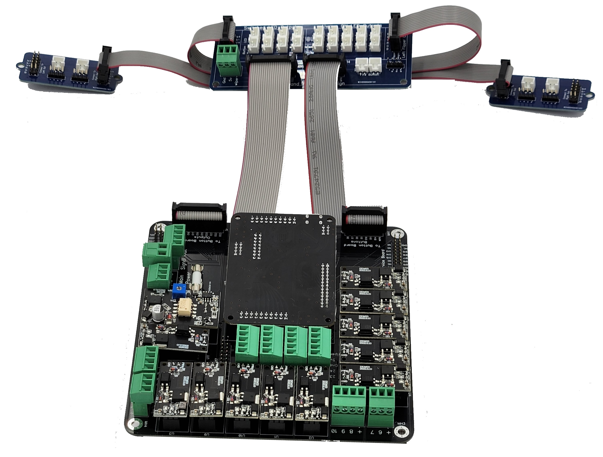
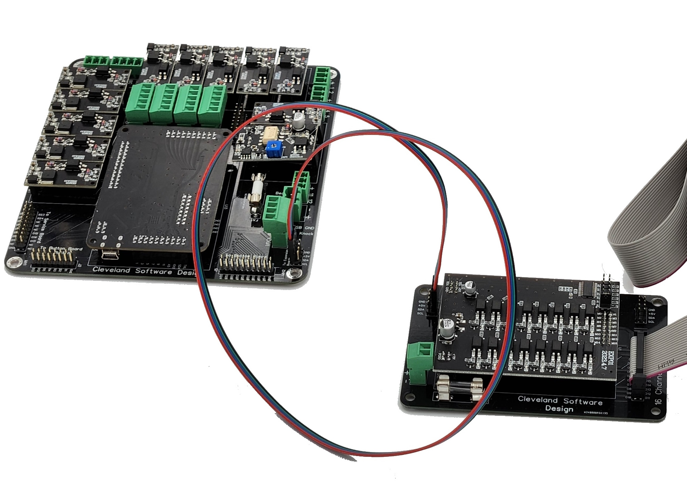

import Video from '@site/src/components/Video';

# PinOne Main Board

## Introduction

The PinOne Main board is a board that attaches to the PinOne and exposes all the inputs/outputs in a way so that you can easily connect perephrials and other devices to your board. The board by itself supports the following options:

- 16 button inputs through pluggable screw terminals
- Plunger input through pluggable screw terminals
- 12 high power outputs to connect solenoids and other toys
- Header pins to connect the button board, which supports 14 buttons (5 RGB and 9 normal buttons) along with DOF controlled lighted outputs for 5 RGB and 4 single color buttons -- all powered from the USB port, so no external power supply needed to operate
- 3 additional signal level outputs that can be used to drive other equipment -- the knocker board, as well as other perepherials that only need a signal level output to trigger.
- Header pins for connecting the expansion boards to power the light bar or add another bank of 16 high power outputs to your cabinet
- Header pins to easily connect the service board or add additional buttons to the PinOne
- All the normal PinOne features like nudge/tilt, and many software enabled features

## Difference from PinOne Mini board

A question I get a lot is how can I tell if I should get the PinOne Main board or the PinOne Mini board? They both use the same PinOne control board, so the software is the same, but there are some hardware differences to be aware of. Here are the differences of both of them

| Feature                       | PinOne Main                           | PinOne Mini             |
| ----------------------------- | ----------------------------------    | ----------------------- |
| **Number of High Power Outputs**     | **12** - 11 mosfet, 1 motor controller    | **2** - With Life extenders |
| **Number of Life Extenders** | **0** - designed to be used with life extenders if adding solenoids | **2** - designed to have 2 solenoids plugged directly into board |
| **Number of Button Inputs**          | **14** - screw terminal type                | **9** - JST-XH connectors     |
| **Number of Low Power Outputs**      | **3** - Normally for knocker and 2 others | **16** - enough for 5 RGB buttons and 4 single color buttons |
| **Input Voltage** | **5V-36V** | **5V-24V** |
| **Plunger input** | **Yes** - dedicated 3 wire input | **Yes** - dedicated 3 wire input |
| **Supports Button Board** | **Yes** - Required for lighted button outputs | **No** - Buttons connect directly to board |
| **Supports PinOne Mini Expansion Board** | **No** - All high power outputs are on the PinOne Main Board | **Yes** - Used to upgrade the Mini to a PinOne Main like board |
| **Supports Service Board** | **Yes** | **Yes** |
| **Maximum Supported Outputs** | **63** | **63** |
| **Maximum Supported Inputs** | **24** | **24** |

## Hooking it all up

### Connecting to the PC

Connecting to your PC is simple through a USB cable. Once you plug it into the PC, you can use the configuration tool to activate all the outputs and configure the board. Unless you want to use the high power outputs, there is no need to connect a power supply

### Button Board

In order to easily connect buttons and get the lighted buttons working, you need to use the [Button Hookup Kit](https://www.clevelandsoftwaredesign.com/pinball-parts/p/virtual-pinball-button-hookup-kit). This allows you to easily connect RGB and LED buttons to the kit. If you are only using non-lighted buttons then you can opt to connect them directly to the board using the built-in screw connectors, but those are typically used for extra buttons that aren't routed through the button kit, like a tilt bob or a power switch. If you are looking for a solution that doesn't require the button board for lighted buttons, then checkout the [PinOne Mini](https://www.clevelandsoftwaredesign.com/pinball-parts/p/pinone-mini-virtual-pinball-connection-board) It sacrifices outputs, but has all the button connections built into the board.

### Expansion Board

The [Expansion Boards](https://www.clevelandsoftwaredesign.com/pinball-parts/p/pinone-expansion-board) are connected to the 4 pin headers labeled "to expansion board" available on the main board. There are two rows of 4 pins, but only one of them needs to be used. You can connect up to two expansion boards to a PinOne board to add an additional 32 PWM outputs. (63 outputs total)

Be sure when connecting the 4 pin wires to the expansion board that the wires are connected the right way, as you can reverse the polarity when connecting. Ensure the black wire is going to the pin labeled "GND" on both boards

The low power expansion board is required to run the [Light Bar](https://www.clevelandsoftwaredesign.com/pinball-parts/p/rgb-12v-virtual-pinball-light-bar)

### Plunger

A [Plunger](https://www.clevelandsoftwaredesign.com/pinball-parts/p/virtual-pinball-plunger-attachment) can be connected directly to the main board via the 5 pin connector where it is labeled "GND", "5V" and "WIPER" by connecting those inputs to the corrisponding inputs on the plunger board. It can also be connected through the button board as another option to keep the wires a little more controlled in the cabinet.

### Knocker

There is a dedicated knocker output that is a low power output (signal only) on the board. This is designed to be plugged into the [Knocker Board](https://www.clevelandsoftwaredesign.com/pinball-parts/p/12v-to-24v-knocker-circuit-conversion-kit) Simply connect the "USB GND" to the "Signal -" and the "knocker" output to the "signal +" on the knocker board.

### Service Board

This is as simple as just connecting the 20 pin ribbon cable from the PinOne main board to the [Service Board](https://www.clevelandsoftwaredesign.com/pinball-parts/p/expansion-breakout-board-zx5y6).

### Connecting other devices

Below is a picture showing how to connect most devices to the PinOne Main board

